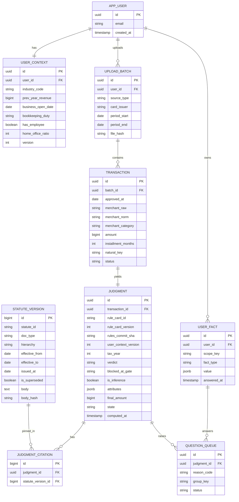
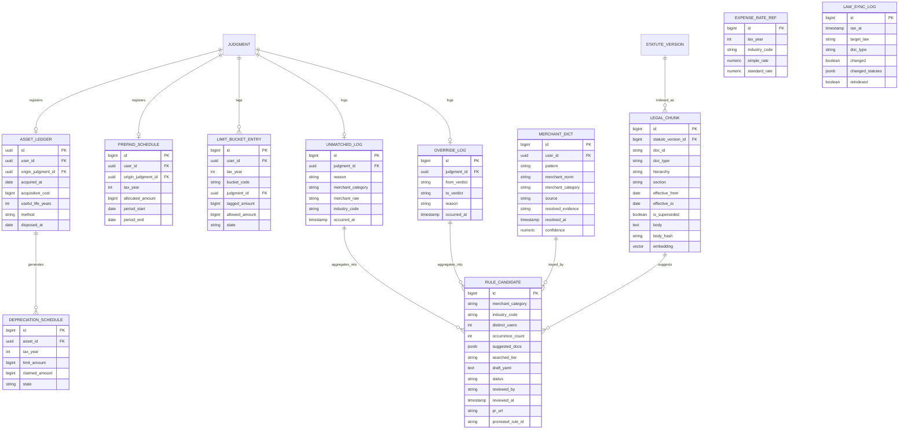

# 종합소득세 경비 판정 에이전트 — 프로젝트 컨텍스트 v2

> 설계 논의 전체를 정리한 문서입니다. 결정 사항뿐 아니라 **왜 그렇게 결정했는지**와 **어떤 대안을 왜 버렸는지**를 함께 담았습니다. 코드를 쓰기 전에 전체를 읽어주세요.
>
> v2 = 팀 회의 결정 반영 (6관문 복원 · OpenAI 스택 · 룰카드 저장 구조 · 카드사 2종 · (b)안 폐기)
> 팀: 부산대 4팀 (카카오테크 캠퍼스)

---

## 0. 한눈에

**만드는 것:** 1인 개인사업자의 카드 승인내역을 받아, 지출 건별로 필요경비 인정 여부를 조문 근거와 함께 판정하는 서비스.

**핵심 설계:** 판정은 **결정론적 룰 엔진**이 한다. 판정 경로에 LLM이 없다. AI는 판정 진입 전(가맹점 카테고리 분류)과, **보고서 생성 · 신규 규칙 카드 생성** 두 곳에 있다.

**한 줄 표현:** *"AI가 규칙을 만들고, 규칙이 판정한다."*

**팀:** 6명 / 기간: 2026-09 ~ 2026-11 (11주) / 배포: 11/6 v1.0
**역할:** 기획·발표 2명, PM 1명, 백엔드 2명, 프론트 2명, **AI 리드 1명(Kang)**

**Kang 담당:** RAG · 에이전트 설계 · 자동화 파이프라인 · QA(평가셋·회귀) · 데이터 파이프라인

---

## 1. 문제 정의와 페르소나

### 페르소나 (1차 집중)

```
1인 IT 사업자 + 강의 병행 / 30대
- 인적용역 사업자(업종코드 940909), 직원 없음, 물적시설 없음
- 연매출 8,200만원 → 7,500만원 초과로 복식부기 의무자
- 단순경비율 기준선 초과. 추계로 가면 기준경비율이 적용되는데,
  기준경비율은 매입비용·임차료·인건비만 증빙으로 인정 → 1인 사업자는 그 셋이 거의 없음
  → 실제 경비를 인정받으려면 장부로 한 건씩 세는 수밖에 없음
- 3월 350만원 맥북 구입 (히어로 시나리오)
- 사업용 카드 1장 + 개인 카드 2장 혼용
- 자택 겸 작업실, 업무용 차량 없음
```

**IT + 강의로 정한 이유:** 개발 지출(맥북·연간구독·자택 안분)을 전부 유지하면서 **강의로 인한 접대비·출장 교통비가 추가**된다. 그래서 한도 버킷(G6)과 집계 단계가 실전 데이터로 검증된다. 개발자만이면 접대비가 거의 없어 한도 로직이 안 터진다.

**⚠️ 검수자 질문:** 강의 소득이 사업소득인지 기타소득인지에 따라 필요경비 계산 방식이 달라진다. 계속·반복적이면 사업소득, 일시적이면 기타소득.

### 문제 한 문장

> 1인 개인사업자는 같은 지출도 업종·매출·직원 유무에 따라 경비 인정 여부가 갈리는데 자기 기준을 확인할 방법이 없어서, 5월에 1년 치를 놓고도 애매한 것은 그냥 빼는 식으로 넘어간다.

### 포지셔닝

> **세무사를 대체하지 않는다.** 세무사에게 맡기기 전에 필요한 자료와 질문 목록을 취합해준다.
> 신고·제출·환급 대행을 하지 않는다. 세액을 확정 제시하지 않는다. 절세 컨설팅을 하지 않는다.

### 히어로 시나리오

**"맥북 350만원 → 올해 경비는 583,333원"**

100만원 초과라 자산으로 처리되고, 내용연수 5년 정액법으로 상각. 3월 취득이라 10개월분만: `3,500,000 ÷ 5 × 10/12 = 583,333원`.

**두 번의 반전("350만원 전액이 아니다" + "올해는 58만원")이 한 화면에** 나오는 게 서비스의 존재 이유다.

---

## 2. 핵심 설계 원칙

### 원칙 1. 판정 경로에 LLM이 없다

```
카드내역 → 정규화 → [모델: 카테고리 분류] → judge() → 판정
                        ↑ 확률적              ↑ 순수 함수
                        판정 엔진 진입 전       같은 입력 → 항상 같은 출력
```

`judge()` 안에는 LLM 호출도, 외부 API 호출도, 랜덤도, 현재 시각 조회도 없다.

**왜:** 세법 판정에서 비결정성은 기능이 아니라 결함이다. 그리고 이 배치 덕분에 **모델이 틀려도 틀린 판정이 나가지 않는다** — 분류가 틀리면 규칙 매칭이 실패해 '확인 필요'로 떨어질 뿐이다.

테크스펙 원문: *"최악의 결과가 틀린 답이 아니라 질문 하나 더가 되는 구조."*

### 원칙 2. 근거를 지어내느니 비워둔다

규칙 카드가 없으면 판정하지 않는다. 근거 칸을 비우고 `is_inference: true`로 표시한다. 확정 판정(가능/불가)에는 반드시 조문 ID가 붙는다.

### 원칙 3. RAG는 판정 경로에 없다

RAG는 두 곳에만 쓴다 — **보고서(핸드오프 문서) 생성**과 **신규 규칙 카드 생성**. 둘은 동일한 코퍼스를 공유한다.

**이 두 곳이 전부이고, 판정 경로에는 어디에도 들어가지 않는다.** 범위를 넓히려면 팀 합의가 필요하다.

**왜:** RAG를 판정에 넣으면 오탐 0건 / 근거 부착률 100% / N-01(동일 입력 동일 출력)이 전부 확률적 보장으로 내려간다.

### 원칙 4. 조문 ID는 하드코딩하고 원문은 DB에서 가져온다

LLM이 조문 번호를 **생성**하게 두면 없는 조문을 만들어낸다.

```
규칙 카드에 조문 ID를 하드코딩 → statute_version에서 그 ID로 직접 조회
LLM은 조문을 고르기만 하고, 인용 문자열은 절대 생성하지 않는다
```

### 원칙 5. 사람이 승인해야 규칙이 된다

| | Fact | 규칙 카드 |
|---|---|---|
| 만드는 주체 | 사용자 (되묻기 응답) | 팀 + 세무 검수자 |
| 적용 범위 | **그 사용자 1명** | **전체 사용자** |
| 검수 | 없음 | **필수** |
| 저장 | `user_fact` 테이블 | `rules/cards/*.yaml` (git) |
| 틀렸을 때 | 그 사람 판정 1건 | **전체 사용자 오탐** |

Fact 하나가 규칙이 되는 게 아니다. **여러 사용자의 Fact가 같은 방향을 가리킬 때 팀이 조사할 후보**가 된다.

### 원칙 6. 되돌릴 수 없는 칸 0개

신고·제출·결제·금전 이동·외부 발송을 만들지 않는다. 모든 판정은 사용자가 뒤집을 수 있다.

---

## 3. 판정 엔진 — 6관문

### 구조

```
[게이트 0] 입력 검증
   승인내역/청구내역 판별 · 취소 상계 · 판정 대상 판별
        ↓
[G1] §33 명백 불산입      차단형 · 첫 히트에서 종료 → 불가
        ↓
[G2] §27 통상성           차단형 · 규칙 카드 매칭으로 구현
        ↓                  매칭 실패 → 확인 필요 [종료]
[G3] 안분                 속성형
[G4] 자산화(감가상각)      속성형
[G5] 증빙                 속성형
[G6] 한도                 속성형 · 태그만 부여
        ↓
[금액 산정]  안분 · 기간배분 · 상각 · 부가세 차감
        ↑
   [경로 B] 자산대장 · 선급비용 스케줄에서 생성된 이월 경비 합류
        ↓
[집계 단계]  한도 버킷 연 누적 → 초과분 배분 (건별 아님)
        ↓
[가능]  계정과목 → 필요경비명세서 15칸
```

### ⭐ 관문은 6개지만 내부 동작이 두 종류다

| | 관문 | 동작 |
|---|---|---|
| **차단형** | G1, G2 | 걸리면 **즉시 종료**. 판정을 확정 |
| **속성형** | G3, G4, G5, G6 | 걸려도 **계속 진행**. `attributes`에 정보만 누적 |

```java
// 차단형
return Judgment.blocked(...);   // 종료

// 속성형
attrs.putAll(result.attrs());   // 누적하고 계속
```

**속성형을 조기 종료로 만들면 정보가 잘린다.** "증빙 없는 한도 초과 접대비"는 G5와 G6 정보가 둘 다 필요하다.

**속성형의 판정과 `attributes` 병합은 순서가 결과에 영향을 주면 안 된다.** 계정과목 기본값은
명시된 G2→G6 순서와 관문 내부 정렬로 선택한다. CI에 "실행 순서를 섞어도 같은 결과인가"
property test를 넣어 검증할 것.

### ⭐ G2 §27은 규칙 카드 매칭으로 구현한다 (팀 결정)

§27 제1항: *"필요경비에 산입할 금액은 해당 과세기간의 총수입금액에 대응하는 비용으로서 일반적으로 용인되는 통상적인 것의 합계액으로 한다."*

**이건 그 자체로 실행 가능한 코드가 아니다.** 규칙 카드가 이걸 구체화한 것이고, R-027(카페) 카드의 존재 자체가 "카페 지출의 통상성 판단은 이렇게 한다"는 선언이다.

```
매칭 성공 → 카드가 지정한 판정으로 속성 관문 진행
매칭 실패 → 확인 필요 + is_inference=true + 근거 공란 → 즉시 종료
           → unmatched_log 적재 → 규칙 후보 큐
           → ⚠️ 에이전트 개입 없음
```

**⚠️ G2 매칭 실패 시 에이전트가 유사 카드를 고르는 (b)안은 폐기했다.** 판정 결과가 안 바뀌는데(확인 필요 그대로) 호출 60회와 재검증 로직이 필요해 비용 대비 얻는 게 없었다. 대신 **사용자가 "이 지출이 무엇인지 알려주세요"를 눌렀을 때만** 카테고리 후보를 제안한다.

### ⭐ G6 한도는 건별로 계산하지 않는다 (팀 결정)

```
접대비 한도 300만원, 거래 A(200만) B(150만)
A→B 순서: A 통과, B는 100만만
B→A 순서: B 통과, A는 150만만
→ 같은 데이터에 다른 답. N-01 위반
```

**G6는 버킷 태그만 붙인다.** 실제 한도 계산은 전 거래 판정이 끝난 뒤 집계 단계에서.

### 관문 순서가 결과를 바꾼다 — 법적 근거

**§33 제2항:** 제1항 제5호·제10호·제11호 및 제13호가 동시 적용되는 경우 **대통령령으로 정하는 순서에 따라 적용한다.**

"순서가 결과를 바꾼다"는 팀 주장이 발표용 수사가 아니라 법이 직접 규정한 사항이다.

**⚠️ 위임받은 시행령 조항은 미확인.** 페르소나에 차입금이 없어 10·11호가 발생하지 않으므로 1차에서는 급하지 않다. 검수자 질문 목록에 있음.

**G1을 G2보다 먼저 봐야 하는 이유:** 순서를 뒤집으면 "업무 중 뗀 과태료니까 업무 관련 → 통상적 → 가능"이 되어 오탐이 난다.

---

## 4. 관문별 상세

### 게이트 0 · 입력 검증

**판정하지 않는다.** 판정 대상이 아닌 행을 골라내고 정리한다.

| 처리 | 내용 |
|---|---|
| **입력 소스 판별** | 승인내역 / 청구내역 / 판별불가. **청구내역이면 업로드 차단 + 안내** |
| 취소·환불 상계 | 음수 금액을 원거래와 매칭해 제거 |
| 대상 판별 | 카드사 수수료·연회비·입금은 제외 |
| 해외 결제 | 원화 환산 |

**⚠️ 할부는 "병합"이 아니다.** 승인내역을 쓰면 할부는 1건(원금 전액, `installment_months=12`)으로 들어온다. 승인은 한 번이니까. 청구내역이면 12줄로 쪼개져 있고, 그걸 처리하면 350만원 맥북이 29만원 12건이 되어 자산 판정을 빠져나간다(오탐).

세법상 취득 시점은 결제 완료일이 아니라 취득(인도)일. **4월 이후 할부금은 채무 상환이라 애초에 경비가 아니다.**

**⚠️ 할부수수료는 별도.** 유이자 할부면 이자비용으로 처리. 명세서에 별도 행으로 찍히는지 실측 확인 필요.

**⚠️ 제외된 행은 "불가"가 아니다.** 화면에 "판정 대상 아님"으로 별도 표시할 것.

---

### G1 · §33 명백 불산입 (차단형)

업무 관련성을 따지기 **전에** 법이 무조건 배제하는 항목.

**§33 제1항 15개 호 — 성격별로 배치가 다르다**

1호 소득세·개인지방소득세 / 2호 벌금·과료·과태료 / 3호 가산금·강제징수비 / 4호 징수의무 불이행 납부세액 / 5호 가사경비 / 6호 감가상각비 한도초과액 / 7호 자산 평가차손 / 8호 개별소비세·주세 미납액 / 9호 부가가치세 매입세액 / 10호 건설자금이자 / 11호 채권자 불분명 차입금 이자 / 12호 법령 위반 공과금 / 13호 업무무관 금액 / 14호 선급비용 / 15호 고의·중과실 손해배상금

| 성격 | 호 | 처리 위치 |
|---|---|---|
| **전액 차단** | 1·2·3·4·8·10·11·12·15 | **G1** |
| **금액 조정** | 6(감가상각 한도), 9(부가세), 14(선급비용) | G4 / 금액 산정 |
| **조건부·안분** | 5(가사), 13(업무무관) | G3 / G2 |
| 범위 밖 | 7(평가차손) | 카드내역에 안 나타남 |

**⚠️ 전부 차단형으로 처리하면 맥북이 '불가'가 된다.** 6호는 "감가상각비 중 한도 초과분"이 불산입이지 자산 자체가 불산입이 아니다.

**순서가 곧 인용 조문:** 주차위반 과태료는 2호(과태료)와 12호(법령 위반 공과금) 둘 다 해당. **더 구체적인 2호를 인용해야 한다.** G1 내부 평가 순서를 `priority`로 관리.

---

### G2 · §27 통상성 (차단형)

**이 서비스의 심장.** 규칙 카드 매칭으로 구현. (위 §3 참조)

**G2 매칭 실패의 경우들**

| 사유 | 원인 발생 지점 | 해결 주체 |
|---|---|---|
| **규칙없음** | G2 | **규칙 카드** ⭐ 규칙 후보의 진짜 입력 |
| 미분류 | **판정 엔진 진입 전(분류 단계)** | 가맹점 사전·조사 |
| 프로파일빈칸 | G2 (매칭은 성공) | 업종 프로파일 |
| 조건이탈 | G2 | 금액·업종·효력기간. 카드 정비 |
| 미검수 | 로딩 단계 | 릴리즈 게이트로 강제 |

**⚠️ `unmatched_log.reason`에 이 구분을 반드시 기록할 것.** 가맹점 사전이 두꺼워지면 `미분류`는 빠르게 줄지만 `규칙없음`은 안 줄어든다. 합쳐놓으면 "규칙 후보가 왜 안 쌓이지"의 원인을 못 찾는다.

**대비책: 카테고리마다 조건 없는 기본 카드 1장.** 금액 조건이 붙은 카드가 다 빗나가도 기본 카드가 받는다. `verdict`는 `확인필요`로.

---

### G3 · 안분 (속성형)

**근거:** §33-1-5, 시행령 §61①1, **소득세법 기본통칙 33-3**

기본통칙 33-3: 지급금액이 주로 업무수행상 통상 필요로 하고 **그 필요로 하는 부분이 명확히 구분될 때 그 구분되는 금액에 한하여** 산입. 명백하지 않거나 주로 가사 관련이면 불산입.

**타입 셋 — 기준이 다르다**

| 타입 | 대상 | 문진 | 처리 |
|---|---|---|---|
| **면적 기준** | 월세·관리비·전기·수도·가스 | 작업공간 면적 비율 % | 자동 안분 |
| **전용 여부** | 통신·인터넷 | 전용/공용 이분법 | 전용=100% / 공용=확인 필요 |
| **제도** | 차량·주유 | 보유 여부 | **범위 밖 → 핸드오프** |

**휴대폰을 "몇 %"로 안 묻는 이유:** 사용자도 답을 모르고, 대답해도 근거가 없다. 비율이 아니라 "업무 전용 회선인가"로 묻는다.

**차량이 범위 밖인 이유:** 업무용승용차는 안분이 아니라 별도 제도(운행기록부·한도·상각특례). 규칙 카드 몇 장으로 안 끝난다.

**Fact를 조회하는 유일한 관문.** Fact가 있으면 자동 적용되어 매달 안 물어본다. F-07이자 락인의 실체.

**⚠️ 판정이 아니라 금액을 바꾼다.** 전기료 10만원에 안분율 20%면 판정은 '가능'이고 금액이 2만원.

**⚠️ 우리가 비율을 제안하지 않는다.** "30%로 하세요"는 세무 조언이고 스펙아웃한 절세 컨설팅에 걸린다. 안내는 "정해진 기준은 없으니 실제 사용 기준으로 답하시고 소명 자료를 남겨두세요"까지만.

**⚠️ 검수자 질문:** 시행령 §61①1 후단의 "주택 관련 경비"가 자택 겸 작업실에 해당하는지. 이 관문의 전제다.

---

### G4 · 자산화 (감가상각) (속성형)

**근거:** §33-1-6, 시행령 §62~§67

| | 임의인가 |
|---|---|
| **자산이냐 당기 비용이냐** | ❌ **강제.** 100만원 초과면 자산 |
| 그 해 얼마를 계상할까 | ✅ 한도 내에서 자유 |

**관문이 필요한 이유가 여기 있다.** 350만원 맥북을 당기 전액 비용으로 넣으면 부인당한다. G4가 없으면 "가능 · 3,500,000원"이 나가고 이건 오탐이다.

**계산 규칙**
- **경계선 100만원** — 시행령 §67④ 즉시상각의 의제
- **예외** — 사업 개시·확장 취득 자산, 고유업무 성질상 대량보유 자산은 100만원 이하라도 자산
- **내용연수** — 비품 기준 5년, 신고 시 4~6년 범위
- **월할상각** — 사업 사용 월수 ÷ 12, 1월 미만 일수는 1월로
- **상각방법** — 정액법/정률법. 무신고 시 건축물은 정액법, 그 외 유형자산은 정률법
- **임의계상** — 필요경비로 계상한 경우에 한하여 상각범위액을 한도로 산입

**→ `depreciation_schedule`에 `limit_amount`(법정 한도)와 `claimed_amount`(실제 계상)를 분리해야 한다.** 합치면 "소득 적은 해엔 덜 넣기"가 영영 불가능해진다.

**화면 문구:** "583,333원을 넣으세요"가 아니라 **"583,333원까지 넣을 수 있습니다"**. 기본값은 한도, 수정 가능.

**⚠️ G4만 가진 특수성 — 거래가 없어도 산출물을 낸다 (경로 B)**
```
2025-03 맥북 취득  → 2025년 상각액 583,333원   (거래 있음)
2026년   거래 없음  → 2026년 상각액 700,000원   (거래 없는데 경비 발생)
```
작년 자산의 올해 상각액은 올해 카드내역 어디에도 없다. 자산대장에서 생성되는 별도 라인이다.

**⚠️ 검수자 질문:** 내용연수 5년인데 중간에 덜 계상하면 5년 후 남은 잔액을 어떻게 처리하는지.

#### 기간귀속(선급비용)도 여기서 다룬다

**§33-1-14 선급비용.** 연간 구독(JetBrains·Adobe·AWS 선결제), 도메인 다년 등록, 보험료 연납.

**할부와 전혀 다르다**

| | 할부 | 선급비용 |
|---|---|---|
| 무엇을 나누나 | **돈 내는 방법** | **서비스 받는 기간** |
| 세법상 성격 | 4월 이후는 채무 상환 | 각 연도 몫이 각 연도 비용 |
| 승인내역 표시 | ✅ 할부개월 컬럼 | ❌ **그냥 일시불** |

```
할부:      2025-03-14 | 애플코리아 | 3,500,000 | 할부 12개월
연간구독:  2025-09-02 | JetBrains  | 1,200,000 | 일시불
                                                    ↑ 12개월치라는 정보 없음
```

**카드사는 "얼마를 어떻게 나눠 낼지"만 알지 "그 돈으로 뭘 얼마 동안 받는지"는 모른다.**

**→ 되묻기가 필수다.** 카테고리 + 금액으로 후보를 잡고 사용자에게 확인. 임계는 낮게 잡아 과잉 질문을 감수하는 게, 놓쳐서 오탐이 나가는 것보다 낫다. Fact로 저장되면 다음부터 안 묻는다.

**⚠️ 구현 안 하면 오탐.** 연간 구독 120만원을 전액 당해 경비로 판정한다. 최소한 "연간 구독 가능성 카테고리는 확인 필요로 강등" 카드 1장은 필요.

---

### G5 · 증빙 (속성형)

3만원 초과 지출에 적격증빙이 있는지 보고, 없으면 가산세 플래그.

**출력은 `가산세_대상` 플래그. 판정은 여전히 '가능'.**

**⚠️ 카드내역 입력에서는 거의 항상 통과한다.** 신용카드매출전표 자체가 적격증빙이다. 그래서 차단형이 아니라 속성형.

**그럼 왜 두나:** (a) 현금·계좌이체 확장 시 살아남 (b) **"가능이지만 가산세 위험"이라는 제3의 상태를 표현하는 자리**가 필요. 3분류 어디에도 안 들어간다.

**금액 기준 두 개를 섞지 말 것:** 접대비 일반은 건당 3만원 초과, 경조사비는 20만원 이하까지 없이 인정. 별도 카드로 분리. (금액은 조문 대조 후 확정)

**⚠️ 검수자 우선 질문:** 접대비 적격증빙에 **사업용 신용카드 사용** 요건이 걸리는지. 페르소나가 개인카드를 혼용하니 여기 걸리면 G5가 no-op이 아니라 핵심 관문이 된다.

---

### G6 · 한도 (속성형)

**태그만 붙인다. 판정하지 않는다.**

**근거:** 버킷마다 다름 — **접대비 §35, 기부금 §34**

**태그가 필요한 진짜 이유는 F-11(요약 화면).** 연말 계산만이면 계정과목 필터로 충분하지만, 매달 잔량 게이지를 보여주려면 태그가 필요하다.

```
접대비  2,840,000 / 3,000,000  ████████░ 95%
기부금    150,000 / 2,500,000  █░░░░░░░░  6%
```

**이 페르소나(IT + 강의)에서 실제로 켜진다.** 개발자만이면 접대비가 거의 없어 한도 로직이 실전에서 안 터졌다.

---

### 금액 산정

```
결제금액
  → 안분율 적용         (G3)
  → 기간 배분           (G4 선급비용)
  → 상각 스케줄         (G4 자산)
  → 부가세 매입세액 차감 (§33-1-9)
= 당해연도 필요경비
```

**독립 단계로 뺀 이유:** 평가셋에서 **판정과 금액을 따로 채점**하기 위해서. "판정은 맞는데 숫자가 틀림"은 실질적으로 오탐인데, 금액 로직이 다른 데 숨어 있으면 어디가 틀렸는지 특정이 안 된다.

**⚠️ 모델이 아니라 코드가 계산한다.** LLM 산술은 신뢰할 수 없고, 리포트에 틀린 숫자가 한 번 뜨면 신뢰가 무너진다.

**⚠️ 계산 순서를 고정하고 문서화할 것.** 안분 먼저인지 부가세 차감 먼저인지에 따라 결과가 달라진다. **미정. W4 안건.**

**부가세는 현재 페르소나에서 비활성.** 940909 인적용역은 면세라 부가세 포함 전액이 경비. 2차 페르소나(일반과세)에서 켜진다.

---

### 집계 단계 (건별 아님)

```
1. 버킷별 연 합계          접대비 4,200,000원
2. 한도 산출               기본한도 + 수입금액 × 적용률
3. 초과액                  1,200,000원
4. 결정론적 배분           어느 거래를 깎을지
5. allowed_amount 확정
```

```java
List<Judgment> js = txs.stream().map(tx -> judge(tx, ctx, facts, rules)).toList();  // 건별
js = js.stream().map(j -> computeAmount(j, ctx)).toList();                          // 건별
js = settleLimits(js, ctx, Mode.잠정);                                              // ⭐ 리스트 전체
```

**`settleLimits`가 리스트를 받는 게 포인트.** 한도를 건별로 계산할 수 없다는 사실이 함수 시그니처에 드러나 있다.

**⚠️ 배분 규칙을 문서화하지 않으면 재현이 안 된다.** DB 조회 순서는 보장되지 않는다. 예: 일자 역순 → 동일자는 금액 역순 → 거래ID 순. **미정. W4 안건.**

**잠정 / 확정 두 모드**
```
연중 (매달)  직전연도 수입금액 기준 → 예상 한도 → 잔량 표시   [잠정]
연말 이후    확정 수입금액 기준 → 최종 한도 → 배분          [확정]
```
접대비 한도는 수입금액에 연동되는데 연중에는 그 해 수입이 확정되지 않는다. 문진의 직전연도 수입금액으로 잠정 계산하고 **"직전연도 기준 잠정치입니다"**를 표시. "세액을 확정 제시하지 않는다"는 원칙과도 맞는다.

**잠정 집계가 월 1회 사용 동기다.**

**⚠️ 되묻기가 여기를 되감는다.** 안분 답변이 오면 금액이 바뀌고 집계도 다시 돌아야 한다. **재실행 진입점은 "속성 관문(G3)부터"** — 게이트 0·G1·G2는 다시 돌 필요 없다.

**⚠️ 상태 전이 규칙(누가 언제 확정으로 올리나) 미정. W4 안건.**

**화면에서는 개별 부인보다 총액으로:** "3/14 접대비 200,000원 → 80,000원만 인정"보다 "접대비 총 4,200,000원 중 1,200,000원 한도 초과"가 정확하고 이해하기 쉽다.

---

### 계정과목 배정

**근거:** 국세청 업종별 작성사례 계정과목 분류표(확보 완료), 별지 제82호 서식

**⚠️ 여기서 새로 판단하지 않는다.** 계정과목은 규칙 카드가 이미 지정하고 있어야 한다. 이 단계는 매핑이지 판단이 아니다.

**판정 중 기본값은 G2부터 G6까지 적용 순서에서 처음 만나는 null이 아닌 카드 `account`다.**
이후 관문의 카드가 이를 덮어쓰지 않는다. 되묻기 응답의 `effect.account`는 기본값보다
우선하며, 여러 응답이 서로 다른 계정과목을 지정하면 두 규칙·질문 출처를 포함한 오류로
판정을 중단한다. 최종 판정이 불가면 계정과목은 항상 비운다.

**1차에서는 확정하지 말고 후보 2~3개 제시.** 1,541개 업종의 계정과목 관행을 규칙으로 다 적을 수 없다. F-13이 P2인 게 다행.

---

## 5. 판정 엔진 코드

**판정 엔진은 Java(Spring Boot)다. 백엔드 소관.** 이 문서에 남아 있는 Python 코드
(§9-5 규칙 후보 추출, §10 RAG)는 전부 `ai` 서버 소관이며 판정 경로가 아니다.

**⭐ `judge()`는 Spring 빈이 아니고 Repository를 보지 않는다.** 순수 도메인 모듈로
분리해야 §9-4 평가 회귀 하네스가 DB 없이 단위 테스트로 돈다. DB가 끼면 조회 순서가
들어와 N-01(동일 입력 동일 출력) 검증 자체가 무의미해진다.

```java
public record RuleCard(
    String id, int version, Gate gate, int priority,
    Match match, Verdict verdict, List<Citation> citations
) {}

public enum Gate {
    G0("입력 검증", BLOCKING),  G1("명백 불산입", BLOCKING), G2("통상성", BLOCKING),
    G3("안분",     ATTRIBUTE), G4("자산화",    ATTRIBUTE),
    G5("증빙",     ATTRIBUTE), G6("한도",      ATTRIBUTE);
    // 카드 YAML 은 `gate: G1` 로만 쓴다. 화면·리포트 라벨은 이 enum 이 붙인다.
}

RuleSet loadRules(Path dir) throws IOException {
    List<RuleCard> cards;
    try (Stream<Path> files = Files.list(dir.resolve("cards"))) {   // rules/cards/*.yaml
        cards = files.filter(f -> f.toString().endsWith(".yaml"))
                     .map(RuleCardLoader::read)
                     .toList();
    }
    validateSchema(cards);
    validateStatuteIdsExist(cards);      // 조문 환각 차단
    validateNoMatchingConflict(cards);   // 같은 관문 내 충돌 검사
    return RuleSet.byGate(cards.stream()
            .sorted(comparingInt(RuleCard::priority)
                    .thenComparing(RuleCard::id))   // ⭐ 결정론의 핵심
            .toList());
}

// ⚠️ Files.list() 반환 순서는 OS·파일시스템마다 다르다. 로딩 직후 priority → id 로
//    반드시 재정렬한다. 안 하면 같은 코드가 개발 머신과 서버에서 다른 조문을 인용한다.
```

### 매칭 조건 — 6개로 고정

```java
static boolean matches(RuleCard card, Transaction tx, UserContext ctx) {
    Match m = card.match();
    if (m.category() != null && !m.category().contains(tx.merchantCategory()))              return false;
    if (m.excludeCategory() != null && m.excludeCategory().contains(tx.merchantCategory())) return false;
    if (m.keyword() != null && m.keyword().stream().noneMatch(tx.merchantRaw()::contains))  return false;
    if (m.amountMin() != null && tx.amount() < m.amountMin())                               return false;
    if (m.amountMax() != null && tx.amount() > m.amountMax())                               return false;
    if (m.industry() != null && !m.industry().contains(ctx.industryCode()))                 return false;
    return true;
}
```

**전부 AND. 없는 조건은 자동 통과.** `keyword`만 내부적으로 OR.

| 조건 | 비교 대상 | 사용 빈도 |
|---|---|---|
| `category` | `tx.merchant_category` | **대부분의 카드** |
| `keyword` | `tx.merchant_raw` (원문) | G1, 특정 가맹점 지목 |
| `amount_min/max` | `tx.amount` | G4·G5, 카테고리 내 세분 |
| `exclude_category` | `tx.merchant_category` | 금액 기준 카드의 예외 |
| `industry` | `ctx.industry_code` | **드묾** (프로파일이 대신) |

**`category`와 `industry`는 다른 대상이다.** 전자는 **가맹점**(돈 받은 쪽), 후자는 **사용자**(돈 낸 쪽).

**`exclude_category`가 필요한 이유:** G4 자산 카드처럼 **카테고리를 나열할 수 없는 카드**가 있다. "100만원 넘으면 자산"은 카테고리와 무관한 규칙이라, 포함 목록 40개를 쓰느니 제외 목록 3개를 쓰는 게 낫다. 새 카테고리가 생겨도 자동 커버된다.

**⚠️ `eval()`이나 표현식을 넣지 말 것.** 매처가 튜링 완전해지면 규칙 카드가 코드가 되고, 세무 검수자가 못 읽고, 충돌 검사가 불가능해진다. **표현력이 모자라면 조건을 늘리지 말고 카드를 쪼갠다.**

**⚠️ 이전 거래를 참조하지 말 것.** `matches()`가 다른 거래를 보면 순서 의존이 생겨 N-01이 깨진다. 크로스-거래 계산은 집계 단계의 일이다.

### 승자 결정 — best-match (first-match 아님)

```java
static int specificity(RuleCard c) {
    Match m = c.match();
    int s = 0;
    if (m.keyword()  != null) s += 100;   // 가장 좁음
    if (m.category() != null) s += 50;
    if (m.industry() != null) s += 30;
    if (m.amountMin() != null || m.amountMax() != null) s += 20;
    return s;
}

static final Comparator<RuleCard> WINNER =
        comparingInt(RuleCard::priority).reversed()
        .thenComparing(comparingInt(Engine::specificity).reversed())
        .thenComparing(RuleCard::id);

List<RuleCard> matched = rules.of(Gate.G2).stream()
        .filter(c -> matches(c, tx, ctx)).sorted(WINNER).toList();
if (matched.isEmpty())
    return Judgment.unresolved(Gate.G2);   // 확인필요 · is_inference=true · 근거 공란
RuleCard hit = matched.get(0);
```

| 정렬 키 | 역할 |
|---|---|
| `-priority` | 작성자가 명시한 순서. 최우선 |
| `-specificity` | 명시 안 했으면 **조건이 좁은 카드**가 이김 |
| `id` | 동점일 때의 결정론 보장 |

**priority 대역:** 기본룰(큐레이션 카드)은 **401 이상**, 학습룰은 **400 이하**로 나눈다. 검증된 기본룰이 학습룰에 밀리지 않도록 로딩 시 401 미만 카드는 거부한다.

**첫 매치에서 멈추면 뒤에 더 적합한 카드가 있어도 놓친다.** 카드가 늘수록 반드시 발생.

**충돌 검사 (CI):**
```java
void validateNoMatchingConflict(List<RuleCard> cards) {
    for (Gate gate : Gate.values()) {
        if (gate.kind() == ATTRIBUTE) continue;   // 속성형은 다중 매칭이 정상
        List<RuleCard> g = cards.stream().filter(c -> c.gate() == gate).toList();
        for (int i = 0; i < g.size(); i++)
            for (int j = i + 1; j < g.size(); j++) {
                RuleCard a = g.get(i), b = g.get(j);
                if (!overlaps(a.match(), b.match())) continue;
                if (a.priority() == b.priority() && specificity(a) == specificity(b))
                    throw new ConflictException(
                        a.id() + " vs " + b.id() + " — priority를 명시하세요");
            }
    }
}
```
**동점을 허용하지 않는 게 핵심.** `id` 정렬로 우연히 결정론이 되긴 하지만 그건 의도한 게 아니다.

### 엔진 본체

```java
// 순수 함수. Spring 빈 아님. Repository·현재시각·난수 참조 없음.
public static Judgment judge(Transaction tx, UserContext ctx,
                             List<UserFact> facts, RuleSet rules) {
    // ── 차단형 ──
    for (RuleCard card : rules.of(Gate.G1))
        if (matches(card, tx, ctx))
            return Judgment.blocked(Verdict.불가, Gate.G1, card, card.citations());

    List<RuleCard> matched = rules.of(Gate.G2).stream()
            .filter(c -> matches(c, tx, ctx)).sorted(WINNER).toList();
    if (matched.isEmpty())
        return Judgment.unresolved(Gate.G2);   // is_inference=true · citations 비움
    RuleCard hit = matched.get(0);

    // ── 속성형: 전부 평가, 종료하지 않음 ──
    Attributes attrs = new Attributes();
    List<Question> pending = new ArrayList<>();
    for (Gate gate : List.of(Gate.G3, Gate.G4, Gate.G5, Gate.G6))
        for (RuleCard card : rules.of(gate))
            if (matches(card, tx, ctx)) {
                AttributeResult r = applyAttribute(card, tx, ctx, facts);
                attrs.putAll(r.attrs());          // ⭐ putAll — return 아님
                pending.addAll(r.questions());
            }

    if (!pending.isEmpty())
        return Judgment.needsAnswer(attrs, pending, hit.citations());
    return Judgment.of(hit.verdict(), attrs, hit.citations());
}

// 금액 산정과 집계는 judge() 바깥
List<Judgment> js = new ArrayList<>(
        txs.stream().map(tx -> judge(tx, ctx, facts, rules)).toList());
js.addAll(generateCarryover(assetLedger, prepaidSchedule, taxYear));   // 경로 B
js = js.stream().map(j -> computeAmount(j, ctx)).toList();
js = settleLimits(js, ctx, Mode.잠정);
```

**차단형은 `return`, 속성형은 `putAll`.** 이 한 줄 차이가 구조의 핵심.

**공수:** 로더+검증 ~250줄, 매처 ~80줄, 엔진 ~120줄, 속성 핸들러 ~300줄, 금액+집계 ~250줄. **합쳐서 1,000줄 안팎.** 어려운 건 코드가 아니라 규칙 카드의 내용.

---

## 6. 규칙 카드

### 저장 구조 — 후보는 DB, 확정은 git (팀 결정)

```
[자동] 규칙 후보 추출 배치 (주 1회)
   집계 → 위계 탐색 → 초안 생성 → rule_candidate INSERT (status: 대기)
        ↓
[사람] 관리자 페이지
   후보 검토 → 수정 → 승인 / 기각
        ↓
[반자동] 승인 시 GitHub API로 PR 자동 생성
   rules/cards/R-089_온라인교육.yaml 커밋 → PR
        ↓ CI 자동
   평가셋 전건 회귀 + 매칭 충돌 검사
        ↓ Kang 수동
   CI 초록 확인 → 머지 → 배포 시 활성화
```

**왜 이 구조인가:**

| | 후보 DB + 확정 git | 전부 DB | 전부 git |
|---|---|---|---|
| 세무 검수자 접근 | **관리자 페이지** ✅ | 페이지 ✅ | GitHub 계정 필요 ❌ |
| 머지 전 회귀 테스트 | ✅ | **UPDATE는 CI를 안 거침** ❌ | ✅ |
| 기각 기록 추적 | `status: 기각` ✅ | ✅ | 닫힌 PR로 묻힘 |
| 발표 시연 화면 | **우리 화면** ✅ | ✅ | GitHub 화면 |

**세무 검수자가 GitHub를 못 쓴다는 게 결정적이었다.** 오탐 0건의 유일한 담보가 검수자인데, 그 사람에게 PR 리뷰를 가르치는 건 현실적이지 않다.

**머지만 수동으로 둔다.** CI가 빨간불이면 머지하면 안 되니 그 판단은 사람이 한다.
- 세무 검수자 → 관리자 페이지에서 승인 (세법 판단)
- Kang → PR에서 CI 확인 후 머지 (기술 판단)

```python
def approve_candidate(candidate_id, reviewer):
    c = db.get(candidate_id)
    yaml_text = render_rule_card(c)
    branch = f"rule/{c.rule_id}"
    github.create_branch(branch)
    github.commit(branch, f"rules/cards/{c.rule_id}.yaml", yaml_text)
    pr = github.create_pr(branch, title=f"[규칙] {c.merchant_category}")
    db.update(candidate_id, status="승인", pr_url=pr.url, reviewed_by=reviewer)
    return pr.url
```

### 디렉터리 구조

```
repo/
├─ rules/
│   ├─ cards/                 ← ⭐ 활성 규칙 카드만. 카드당 파일 1개
│   │   ├─ R-004_과태료.yaml
│   │   ├─ R-027_카페.yaml
│   │   └─ ... (60~80개)
│   ├─ normalize.yaml         ← 카드 아님. 정규화 규칙 (백엔드가 읽음)
│   ├─ pg_blocklist.yaml      ← 카드 아님. 결제대행사 차단 목록
│   └─ keyword_rules.yaml     ← 카드 아님. 분류 키워드 규칙
├─ profiles/                  ← 업종 프로파일
│   ├─ 940909.yaml
│   └─ ...
└─ eval/cases/                ← 평가셋
    └─ E-001.yaml
```

**⭐ 카드는 `rules/cards/` 안에만 둔다.** 로더가 `rules/` 를 통째로 훑으면 `normalize.yaml`
같은 설정 파일을 카드로 읽으려다 부팅이 실패한다. 디렉터리 하나가 곧 "여기 있는 건 전부
카드다"라는 계약이고, 세무 검수자가 `cards/` 를 열었을 때 카드만 보이는 것도 §6의 취지다.

**카드당 파일 하나로 나누는 이유:** PR diff에 해당 카드만 보여야 검토가 쉽다. 한 파일에 몰면 여러 명이 수정할 때 충돌하고 자동 생성도 어렵다.

**게이트별 디렉터리로 나누지 말 것.** 카드의 `gate` 필드가 이미 그 정보를 갖고 있고, 게이트가 바뀌면 파일을 옮겨야 해서 git 히스토리가 끊긴다. 플랫하게 두고 `gate` 필드로 그룹핑.

**파일명을 바꿔도 카드는 같다.** 로딩은 파일명이 아니라 `id` 필드를 본다.

### 메모리 로딩 — 한계는 사람이지 메모리가 아니다

| 카드 수 | 메모리 | 실제 순회 (카테고리 인덱싱 후) |
|---|---|---|
| 100장 | ~0.5MB | 10~20장 |
| 1,000장 | ~5MB | 10~20장 |
| 10,000장 | ~50MB | 10~20장 |

```java
Map<String, List<RuleCard>> index = new HashMap<>();
for (RuleCard c : cards)
    for (String cat : c.match().category() != null ? c.match().category() : List.of("*"))
        index.computeIfAbsent(cat, k -> new ArrayList<>()).add(c);

List<RuleCard> candidates = Stream.concat(
        index.getOrDefault(tx.merchantCategory(), List.of()).stream(),
        index.getOrDefault("*", List.of()).stream()).toList();
```

| 진짜 한계 | 임계 |
|---|---|
| **사람이 리뷰 가능한 양** | ~300장 |
| **충돌 검사 O(n²)** | ~2,000장 |
| 메모리 | ~50,000장 |

### 카드 실물

```yaml
# rules/cards/R-004_과태료.yaml — G1 차단형
id: R-004
version: 1
gate: G1
priority: 900
효력기간: { 시작: 2025-01-01, 종료: null }
match:
  category: [지자체_과태료, 경찰청_범칙금]
  keyword: ["과태료", "범칙금", "주정차위반"]
verdict: 불가
reason: "업무 중 발생했더라도 법령 위반으로 납부한 금액은 필요경비에서 제외됩니다."
citations:
  - { id: 소득세법-33-1-2, 위계: 법률 }
evidence: []
review: { by: 외부자문, date: 2026-09-05 }
```

```yaml
# rules/cards/R-031_서버클라우드.yaml — G2, 프로파일 참조
id: R-031
version: 1
gate: G2
priority: 500
match:
  category: [서버_클라우드]
verdict_by_profile:          # ← 업종별 답을 프로파일에서
  통상:   가능
  조건부: 확인필요
  비통상: 확인필요
  미기입: 확인필요           # ⭐ 필수. 프로파일 없는 업종의 안전 기본값
account: 지급수수료
reason: "사업 운영에 직접 사용되는 서비스 이용료입니다."
citations:
  - { id: 소득세법-27-1, 위계: 법률 }
evidence: [세금계산서 또는 카드매출전표]
review: { by: 외부자문, date: 2026-09-05 }
```

```yaml
# rules/cards/R-027_카페.yaml — G3 속성형 + 되묻기
id: R-027
version: 1
gate: G3
priority: 401
match:
  category: [카페]
  amount_max: 30000
question:
  text: "이 결제는 어떤 용도였나요?"
  fact_type: 용도
  group_by: merchant_norm      # 같은 카페 12건을 한 화면에
  options:
    - { value: 업무미팅, verdict: 가능, account: 접대비,   limit_bucket: 접대비, evidence: [상대방·목적 메모] }
    - { value: 혼자작업, verdict: 가능, account: 소모품비, evidence: [] }
    - { value: 개인,     verdict: 불가 }
citations:
  - { id: 소득세법-33-1-5,       위계: 법률 }
  - { id: 소득세법기본통칙-33-3, 위계: 기본통칙 }
```

```yaml
# rules/cards/R-051_자산일반.yaml — G4 속성형. verdict 없음
id: R-051
version: 1
gate: G4
priority: 500
match:
  amount_min: 1000001
  exclude_category: [소모품, 식음료, 카페]
attributes:                   # ← 판정 대신 이걸 남김
  자산: true
  내용연수: 5
  상각방법: 정액법
  자산대장_등재: true
reason: "취득가액이 100만원을 넘어 감가상각자산으로 처리됩니다."
citations:
  - { id: 소득세법시행령-62,   위계: 시행령 }
  - { id: 소득세법시행령-67-4, 위계: 시행령 }
evidence: [자산대장 등재]
```

### 필수 요소

**공통:** `id` `version` `gate` `priority` `match` `효력기간` `review`
**차단형(G1·G2):** `verdict` 또는 `verdict_by_profile`, `reason`, **`citations`(가능/불가면 필수)**, `account`
**속성형(G3~G6):** `attributes` (`verdict` 없음)
**되묻기 있으면:** `question` (`fact_type`, `group_by`, `options`)

> 같은 `priority`에서 어떤 카드가 이기는지(구체성 점수·정렬 규칙)는 위 **"승자 결정 — best-match"** 섹션 참고.

### 근거 위계 — 화면 표시가 달라진다

```
법률 > 시행령 > 시행규칙 > 기본통칙 > 고시 > 예규 > 심판례 > 판례
```

- **법률·시행령·시행규칙** → "근거"
- **기본통칙·고시·예규** → "참고 해석기준" (법령이 아니라 국세청 내부 해석기준, 법적 구속력 없음)
- **심판례·판례** → "참고 사례"

**안 나누면 사용자가 전부 같은 무게로 읽는다.**

### 관문별 배분 (목표 60~80장)

| 관문 | 장수 | 유형 |
|---|---|---|
| **G1** | 8~10 | 열거형. **판단이 없어 제일 쉬움 — 여기부터** |
| **G2** | **35~45** | 카테고리별 판정. **작업량의 대부분** |
| **G3** 안분 | 6~8 | 면적 4~5 + 통신 2 + 소액혼재 1~2 |
| **G4** 자산화 | 6~8 | 자산 3~4 + 기간귀속 3~4 |
| **G5** 증빙 | 2~3 | 3만원 일반 / 접대비 / 경조사비 특례 |
| **G6** 한도 | 2~3 | 접대비 / 기부금 버킷 |
| **범위 밖** | 3~4 | 차량 / 건강보험 / 법인·부동산 / 급여·원천세 |

**G2 세부:**
- (a) 업종 무관·항상 가능 12~15장: 사무용품, 서적, 세무·법무 수수료, 보험, 은행 수수료, 임차료, 광고, 배송, SW 구독
- (b) **프로파일 참조 15~20장** ← 업종별로 갈리는 칸
- (c) 업종 무관·항상 불가 5~8장: 개인 의류, 생필품, 취미·레저, 개인 의료, 유흥
- (d) 사용자 상황 참조 3~5장: 직원 유무, 사업장 형태

**⚠️ 40장은 부족하다.** G1과 계산 카드가 25장을 먹으면 실제 카테고리 카드는 15장뿐이고 확인 필요 비율이 70%를 넘긴다. **60~80이 최소선.**

### 작성 순서

| 순서 | 대상 | 장수 | 난이도 | 시점 |
|---|---|---|---|---|
| 1 | G1 | 10 | 낮음 | 9월 1주 |
| 2 | G4·G5·G6 | 12 | 중간 | 9월 1~2주 |
| 3 | 범위 밖 | 4 | 낮음 | 9월 2주 |
| 4 | G2 (a)(c) | 20 | 중간 | 9월 2~3주 |
| 5 | **G2 (b)** | 18 | **높음 — 검수 필수** | 9월 3주~10월 |
| 6 | **프로파일** | 업종당 15~20칸 | **높음 — 검수 필수** | 10월 |
| 7 | G3 | 8 | 중간 | 10월 |

---

## 7. 업종 프로파일

**규칙 카드가 아니라 데이터 테이블.** `profiles/*.yaml`로 git 관리.

```yaml
# profiles/940909.yaml
industry_code: 940909
label: 인적용역 · IT + 강의
통상성:
  서버_클라우드:   통상      # 1칸
  하드웨어_컴퓨터: 통상
  개발도구_구독:   통상
  도서_기술서적:   통상
  교통_출장:       통상      # 강의 병행으로 추가
  숙박:            조건부
  카페:            조건부    # 되묻기 대상
  식자재_마트:     비통상
직원있음_오버라이드:          # has_employee=true일 때만
  식사_커피:       조건부
  경조사비:        조건부
```

**"칸" = (업종 × 카테고리) 조합 하나.** 값은 `통상 / 비통상 / 조건부 / 미기입`. **미기입이 기본값이고 자동으로 '확인 필요'가 되므로 안전하다.**

### 곱셈을 덧셈으로 바꾸는 구조

```
❌ 카드를 업종별로 나눔:  카테고리 50 × 업종 20 = 1,000장
✅ 카드 + 프로파일:       카드 50장 + 프로파일 20장 = 70
```

**같은 카드, 다른 프로파일 → 다른 판정.**
```
IT 프리랜서 → 프로파일[카페] = 조건부 → 확인필요 → 되묻기
카페 사장   → 프로파일[카페] = 비통상 → 확인필요 (개인 지출 추정)
```

### 업종 확장 비용은 지출 구조가 겹치느냐에 달렸다

| 상황 | 비용 |
|---|---|
| 기존 카테고리로 설명되는 업종 (IT → 디자이너·강사·컨설턴트) | **프로파일 1장** ✅ |
| 새 카테고리가 생기는 업종 (병원·건설·제조) | 프로파일 + G2 카드 + **기존 프로파일 전부에 빈칸 추가** ❌ |

**2차 확장은 인적용역 계열로.** 음식점은 직원·재고·부가세가 한꺼번에 걸려 "구조가 버티는지" 검증용으로는 최고지만 저렴한 확장이 아니다.

**⚠️ 프로파일 값 3종으로 부족한 경우가 2차에 나올 수 있다.** 예: 미용실 사장의 미용재료가 `통상`이어도 개인 사용일 수 있다. 금액 임계 추가 등을 재검토할 것.

---

## 8. DB 스키마

### ERD ① 판정 코어



### ERD ② 다년 상태 · 학습 루프 · 참조



### 필드 설명 — 판정 코어

**USER_CONTEXT** — 문진 결과. 판정의 모든 전제.

| 필드 | 설명 |
|---|---|
| `industry_code` | **프로파일 YAML 조회 키**이자 경비율 조회 키 |
| `prev_year_revenue` | 기장의무 판정 + **연중 한도 잠정 계산 기준** |
| `business_open_date` | 신규 사업자 여부 → 경비율 구간 |
| `bookkeeping_duty` | `복식부기`/`간편장부`/`추계` |
| `has_employee` | true면 급여·원천세 범위 밖, 복리후생비 분기 |
| `home_office_ratio` | 작업공간 면적 비율(%). G3가 읽음 |
| `version` | 문진 수정 시 증가. **어떤 문진으로 판정했는지 추적** |

`(user_id, version)` 복합 UNIQUE.

**UPLOAD_BATCH**

| 필드 | 설명 |
|---|---|
| `source_type` | `승인내역`/`청구내역`/`판별불가`. **게이트 0 검증 결과** |
| `card_issuer` | **국민 / 기업 (1차 2종만)** |
| `file_hash` | 동일 파일 재업로드 감지 |

**TRANSACTION**

| 필드 | 설명 |
|---|---|
| `approved_at` | **승인일.** 청구일 아님. 귀속연도 결정 |
| `merchant_raw` | 파일 원문 그대로. 정규화 개선의 재료 |
| `merchant_norm` | `merchant_dict`로 표준화 |
| `merchant_category` | 닫힌 집합 값 또는 `미분류` |
| `installment_months` | 승인 기준이라 원금 1건 |
| `natural_key` | `hash(approved_at + merchant_raw + amount)`. **UNIQUE 필수** — 기간 겹쳐 올려도 중복 계상 차단 |
| `status` | `판정대상`/`취소상계`/`대상제외` |

**STATUTE_VERSION** — 4개 섹션 원문을 모두 담는다. **append-only.**

| 필드 | 설명 |
|---|---|
| `statute_id` | `소득세법-33-1-2`. **버전이 달라도 동일한 안정 ID** |
| `doc_type` | `법령`/`행정규칙`/`심판례해석`/`판례` |
| `hierarchy` | 화면에서 "근거"와 "참고 해석기준" 구분 |
| `effective_from/to` | 시행일 범위. `to`가 NULL이면 현행 |
| `issued_at` | 선고일·생산일 (판례·심판례) |
| `is_superseded` | 폐기·변경·파기 |
| `body_hash` | 변경 감지 |

개정 시 **옛 행의 `effective_to`만 채우고 새 행 추가.**

**JUDGMENT**

| 필드 | 설명 |
|---|---|
| `rule_card_id` | `R-027`. git 관리라 FK 아닌 일반 문자열 |
| `rule_card_version` | 적용 시점 카드 버전 |
| **`rules_commit_sha`** | 부팅 시 `git rev-parse HEAD`. 그 시점 규칙 전체 복원 |
| **`user_context_version`** | 판정 당시 문진 버전 고정 |
| `blocked_at_gate` | **`Gate` enum 이름**(`G0`~`G6`). 정수 저장 금지 |
| `attributes` | jsonb. 속성 관문 누적 |
| `state` | `잠정`/`확정` |

**JUDGMENT_CITATION** — `statute_version_id`(**버전 FK**)

```
규칙 카드   → statute_id          "제33조 제1항 제2호를 인용한다" (시점 무관)
판정 레코드 → statute_version_id  "2025년 시행 본문으로 판단했다" (시점 고정)
```

판정 시 `tax_year`로 유효 버전 조회:
```sql
WHERE statute_id = :id
  AND effective_from <= :귀속연도_기준일
  AND (effective_to IS NULL OR effective_to > :귀속연도_기준일)
```

**USER_FACT** — 개인 스코프. 절대 전역이 되지 않는다.
`scope_key`(`merchant:스타벅스서면점`), `fact_type`(`용도`/`안분율`/`전용여부`/`기간`), `value`(jsonb)

### 필드 설명 — 다년 상태

**ASSET_LEDGER** — `acquisition_cost`는 **할부여도 원금 전액**. `disposed_at` 있으면 이후 상각 중단.

**DEPRECIATION_SCHEDULE** — `limit_amount`(법정 상각범위액)와 `claimed_amount`(실제 계상)를 **반드시 분리.**

**PREPAID_SCHEDULE** — 자산이 아니라 비용(§33-1-14 vs §33-1-6).

**LIMIT_BUCKET_ENTRY** — `tagged_amount`(G6가 건별 태그)와 `allowed_amount`(**집계 단계가 계산**)를 분리. `state`로 잠정/확정.

### 필드 설명 — 학습 루프

**UNMATCHED_LOG**

| 필드 | 설명 |
|---|---|
| **`reason`** | `미분류`/`규칙없음`/`프로파일빈칸`/`조건이탈`. **⭐ 필수** |
| **`merchant_raw`** | `reason=미분류`일 때 카테고리는 정보가 없다. **사전 개선의 재료** |
| `industry_code` | 프로파일 빈칸 식별 |

**⚠️ `user_id`를 넣지 않는다.** 규칙 후보 큐에 개인 지출 패턴이 드러난다.

**OVERRIDE_LOG** — `from_verdict → to_verdict`. **`가능 → 불가`가 오탐 신호.**

**RULE_CANDIDATE**

| 필드 | 설명 |
|---|---|
| `distinct_users` | **2 이상 필터가 개인 특수사정을 걸러냄** |
| `suggested_docs` | 찾은 근거 후보 |
| `searched_tier` | 어느 섹션까지 탐색했는지. 위계 준수 검증 |
| **`draft_yaml`** | 생성된 초안. 관리자 페이지에서 편집 가능 |
| `status` | `대기`/`검토중`/`승인`/`기각`/`보류` |
| `reviewed_by` `reviewed_at` | 검수 이력 |
| **`pr_url`** | 승인 후 자동 생성된 PR |

### 필드 설명 — 참조·인덱스

**MERCHANT_DICT**

| 필드 | 설명 |
|---|---|
| **`user_id`** | **nullable.** NULL이면 전역, 값이 있으면 개인 스코프 |
| `source` | `수기`/`override`/`websearch`/`user` |
| `resolved_evidence` | URL 등 판단 근거 |
| `confidence` | **낮으면 미분류 유지.** 동명이인 오분류 방어 |

**⚠️ 동명이업종 대응 — 개인 스코프가 필수다.**
```
사용자 A의 "성진이네" = 치킨집
사용자 B의 "성진이네" = 문구점
```
전역 사전에 넣으면 다른 사용자에게 틀린 분류가 전파된다. **조회 순서: 개인 → 전역.**

**LEGAL_CHUNK** — 재색인 산출물. 보고서 생성·규칙 후보 추출 전용. 판정 경로는 쓰지 않는다.

| 필드 | 설명 |
|---|---|
| `statute_version_id` | 원문 출처 FK |
| `doc_type` | 위계 순차 탐색 필터 |
| `section` | **판례 전용:** `원고주장`/`피고주장`/`법원판단`. 검색 시 `법원판단`만 |
| `body_hash` | 증분 재색인 판단 |
| **`embedding`** | **vector(1536)** — text-embedding-3-small |

### 스키마 핵심 세 가지

**① 스냅샷 3형제 — 재현성의 전부**
`user_context.version`, `judgment.rules_commit_sha`, `judgment_citation.statute_version_id`.
**나중에 붙일 수 없다.** 과거 판정에 값을 채울 방법이 없다.

**② 잠정/확정 상태 3형제**
`judgment.state`, `depreciation_schedule.state`, `limit_bucket_entry.state`.
집계 단계가 존재하기 때문에 생긴 구조.

**③ "법이 이렇다" vs "나는 이렇다"의 분리**
`rules/cards/*.yaml`(전역, 검수 필수, git) ↔ `user_fact`(개인, 검수 없음, DB).
`rule_candidate`가 유일한 다리이고 그 다리에 **사람의 승인**이 있다.

### mermaid가 표현 못 하는 제약

- `TRANSACTION.natural_key` UNIQUE
- `USER_CONTEXT (user_id, version)` 복합 UNIQUE
- `EXPENSE_RATE_REF (tax_year, industry_code)` UNIQUE
- `MERCHANT_DICT` 조회 시 개인(user_id) 우선, 없으면 전역(NULL)

---

## 9. 파이프라인 5개

> ⚠️ **파이프라인 번호와 우선순위(P0/P1/P2)를 혼동하지 말 것.** 파이프라인은 이름으로 부른다.

| 이름 | 성격 | 트리거 | 담당 |
|---|---|---|---|
| **법령 동기화 → 재색인** | 배치 (2단계) | GH Actions cron 일 1회 | Kang |
| **참조데이터 적재** | 1회성 + 연 1회 | 수동 | Kang |
| **카드내역 정규화** | 온디맨드 | 사용자 업로드 | 프론트+백엔드 |
| **평가 회귀 하네스** | CI | PR마다 | Kang |
| **규칙 후보 추출** | 배치 | GH Actions cron 주 1회 | Kang |

### 1. 법령 동기화 → 재색인

**1단계 · 수집** (매일 03:00 KST = UTC 18:00)
```
[E] 국가법령정보 OPEN API (OC 발급 완료)
      target=law / admrul / expc / prec
      lawSearch.do (목록), lawService.do (본문)
[T] 법령·행정규칙 → 공포번호 + 조문 해시 전량 비교 (수백 건)
    판례·심판례    → 신규 생산분만 증분 (수만 건)
[L] 변경 없음 → law_sync_log 한 줄
    변경 있음 → statute_version 새 행 (append-only)
              → grep으로 영향받는 규칙 카드 탐색
              → GitHub Issue + Discord 알림 → changed=true
```

**2단계 · 재색인 (조건부)**
```yaml
- id: sync
  run: python -m pipeline.law_sync
- name: 재색인
  if: steps.sync.outputs.changed == 'true'
  run: python -m pipeline.reindex --incremental
```

**단계를 나눈 이유는 실행 주기가 아니라 실패 격리.** 임베딩 API가 죽어도 원문은 저장돼 있고 재색인만 다시 돌리면 된다.

**⚠️ 단독 실행도 가능해야 한다.**
```bash
python -m pipeline.reindex --incremental
python -m pipeline.reindex --full --doc-type=판례
```
chunking 전략 변경(**10월에 반드시 겪음**), 임베딩 모델 교체 시 전체 재색인이 필요한데 법령 API를 다시 부를 이유는 없다.

**⚠️ chunking 전략 — 섹션마다 다르다. RAG 품질의 대부분이 여기서 갈린다.**

| 섹션 | 청크 단위 | 결정적 주의점 |
|---|---|---|
| 법령 | 조문 1개 (긴 조는 항) | **단서("다만~")를 자르지 말 것.** 세법은 단서에 실질이 있다 |
| 행정규칙 | 통칙·고시 조항 | 법령 아님을 `hierarchy`에 명시 |
| 심판례·해석 | 문서 통째 | `is_superseded` 필수 |
| 판례 | **"법원의 판단"만** | 원고 주장을 결론으로 오독하면 **패소 판례가 "가능" 근거가 된다** |

**판례·심판례에 결론 태그(`outcome: 인정/부인/일부인정`)를 붙이면 초안 방향이 안정된다.**

**⚠️ 러너 IP 문제:** GH Actions는 IP가 매번 바뀌어 RDS 화이트리스트를 못 쓴다. **Actions는 앱 엔드포인트를 호출만 하고 DB 쓰기는 서버가.**

### 2. 참조데이터 적재

```
[E] 국세청 고시 XLSX 1,541행 + 업종코드 목록
[T] 업종코드 6자리 문자열 정규화 (⚠️ 앞자리 0 보존 — 엑셀이 숫자로 먹는다)
    단순/기준경비율 분리, 귀속연도 태깅
[L] expense_rate_ref, (tax_year, industry_code) UNIQUE + upsert
```
**덮어쓰지 않는다.** 2026년에 2025년 귀속 신고를 하므로 여러 연도가 동시에 살아 있어야 한다.

### 3. 카드내역 정규화

```
[브라우저]
  헤더 판별 → 승인내역/청구내역/판별불가
       청구내역이면 차단 + "승인내역 받는 법" 안내
  카드사별 어댑터 (⭐ 1차는 국민·기업 2종만)
  카드번호·계좌번호 폐기
  → 정규화 레코드만 JSON POST

[서버]
  ① merchant_dict 조회 (개인 → 전역 순)
  ② 업종코드 정적 매핑 (승인내역에 업종 컬럼이 있으면)
  ③ 웹 검색 — 임계값 넘을 때까지
       ⚠️ 국세청 사업자등록 상태조회 API는 진위여부만 알려줘 미사용
       ⚠️ 개인명으로 보이는 상호는 검색 제외
  ④ 모델 분류 (닫힌 집합 + '미분류' 출구)
  ⑤ 동명이업종("성진이네") → 사용자에게 되묻기 → 개인 스코프로 사전 적재
  natural_key UNIQUE upsert → 중복 계상 차단
  취소·환불 상계
```

**웹 검색은 "이 지출이 경비인가"가 아니라 "이 가맹점이 뭐 하는 곳인가"를 묻는다.** 검색 결과는 판정 근거가 아니라 **분류 입력**이다. 틀려도 잘못된 카테고리로 분류될 뿐이고 그러면 다시 매칭 실패해서 '확인 필요'로 떨어진다.

**동명이업종 되묻기 설계**
```
"성진이네에서 무엇을 결제하셨나요?"
  [식사·음료] [사무용품] [장비] [기타: ___]
→ 카테고리로 매핑 → merchant_dict에 개인 스코프로 적재
```
**⚠️ 사용자는 카테고리를 모른다.** 자연어 선택지로 묻고 우리가 카테고리로 매핑한다.

**⚠️ W1 실측:** 국민·기업 승인내역 CSV에 **업종 컬럼이 있는지** 최우선 확인. 있으면 ②가 살아나 모델 호출이 크게 준다.

### 4. 평가 회귀 하네스 ⭐ 가장 먼저 만들 것

```
[정적 검증]
  YAML 스키마 / 조문 ID 실재 / 효력기간 정합성
  ⭐ 매칭 충돌 — 같은 거래에 두 카드가 동점으로 걸리는가
[동적 검증]
  평가셋 전건 실행
  ⭐ 분류 결과를 fixture로 고정 → LLM 호출 0회 → 완전 결정론
  비교: 판정 · 걸린게이트 · 근거조문 · is_inference · 금액(허용오차)
[판정]
  치명(오탐) 1건 → ❌ 머지 차단
  근거 부착률 100% 미달 → ❌ 차단
[출력]
  PR 코멘트: 게이트별 정확도 + 새로 깨진 케이스
```

**fixture로 고정하는 이유:** 모델을 부르면 코드를 안 고쳐도 테스트가 흔들리고, 빨간불의 원인이 "내가 깨뜨림"인지 "모델이 다르게 답함"인지 구분이 안 된다. 노이즈가 섞이면 팀이 빨간불을 무시한다. **고정하면 빨간불 = 100% 내가 깨뜨린 것.**

**⚠️ 평가셋 기대값은 규칙 카드가 아니라 조문에서.** 카드에서 뽑으면 자기가 자기를 채점한다.
**⚠️ 분류기 자체는 여기서 빠진다.** 별도 평가셋으로 CI 밖에서 주기 측정.
**⚠️ 속성 관문 순서 무관 property test**를 넣으면 N-01이 구조적으로 검증된다.

**⭐ 규칙 카드 승인 시에도 이 하네스가 돈다.** 관리자 페이지 승인 → PR 자동 생성 → CI 회귀 → 통과해야 머지.

### 5. 규칙 후보 추출 ⭐ 에이전트

```
[1] 집계 (SQL)
    unmatched_log(reason=규칙없음 중심) + override_log
    (merchant_category × industry_code) 단위
    distinct_users ≥ 2 필터
    빈도순 상위 N건

[2] 위계 순차 탐색  ← 에이전트
    ┌─ 법령 검색                    충분? → [3]
    ├─ 행정규칙 검색                충분? → [3]
    ├─ 심판례·해석 검색             충분? → [3]
    ├─ 판례 검색 (section=법원판단) 있음? → [3]
    └─ 없음 → 보류 (사유 기록)

[3] 초안 생성 — Pydantic 스키마 강제
    validator: 조문 ID 실재 → 실패 시 재시도
    validator: 하위 근거만으로 '가능' 초안을 냈는가

[4] rule_candidate INSERT (status: 대기, draft_yaml)
────────── 여기까지 자동 ──────────
[5] 관리자 페이지 → 세무 검수 승인 → PR 자동 생성 → CI → Kang 머지
```

**위계 순서를 코드로 강제할 것.**
```
법령 (구속력 있음)
  ↓ 행정규칙 (국세청 내부 기준)
  ↓ 심판례·해석 (사안 종속적)
  ↓ 판례 (사안 종속적, 오독 위험)
  ↓ 보류
```
**⚠️ 하위 근거가 상위를 뒤집는 초안이 나오면 안 된다.**

```python
class RuleCardDraft(BaseModel):
    gate: Literal["G1","G2","G3","G4","G5","G6"]
    verdict: Literal["가능","확인필요","불가"] | None
    citations: list[StatuteRef]

    @field_validator("citations")
    def must_exist(cls, v):
        for c in v:
            if not statute_exists(c.id):
                raise ValueError(f"존재하지 않는 조문: {c.id}")
        return v
```

**왜 에이전트인가**

| 요건 | 규칙 후보 추출 |
|---|---|
| 목표가 주어짐 | "미판정 항목을 규칙으로 만들라" |
| 스스로 계획 | 어느 카테고리부터 다룰지 빈도로 결정 |
| 도구 사용 | 4개 섹션 검색, DB 집계 |
| 다단계·분기 | 충분하면 조기 종료, 없으면 다음 섹션, 끝까지 없으면 보류 |
| 상태 변화 | 규칙이 늘어 다음 주 판정이 달라짐 |

**절대 자동화하지 않을 것:** 승격은 사람을 거친다. **승인 시점에 `효력기간.시작`을 박고 기본값은 "소급 적용 안 함".**

### 데이터 흐름

```
법령 API ──[동기화]──> statute_version ──[재색인]──> legal_chunk
                            │                            │
                            │ 조문 ID 직접 조회            │ 하이브리드 검색
                            ↓                            ↓
카드파일 ──[정규화]──> transaction ──[판정]──> judgment   [보고서] [규칙후보]
                                                │                      │
고시XLSX ──[참조]──> expense_rate_ref            │                      ↓
                                          unmatched_log ─────────> 관리자 승인
                                          override_log                │
                                                                      ↓
                                      rules/cards/*.yaml <──── PR + CI 통과
                                               │
                                               └─> 다음 판정에 반영
```

**루프가 닫힌다.**

---

## 10. RAG

### 코퍼스 4개 섹션 — 하나의 테이블

법령 / 행정규칙 / 심판례·해석 / 판례 — **`legal_chunk` 하나에 `doc_type` 필터로 구분.** 섹션별 인덱스를 나누지 않는다.

### 하이브리드 검색

| | 벡터 검색 | 키워드 검색 (pg_bigm) |
|---|---|---|
| 강함 | "맥북 샀는데" → 감가상각 조문 | "제33조 제1항", "3만원", "과태료" |
| 약함 | **숫자·조문번호** | 표현이 다르면 못 찾음 |

**세법에서 치명적인 이유:** 사용자 질문은 구어체고 조문은 법률 문어체라 글자가 안 겹친다(벡터 필요). 동시에 "3만원 초과"와 "5만원 초과"의 임베딩이 거의 같은데 세법에서는 그 숫자가 판정을 가른다(키워드 필요).

**RRF (Reciprocal Rank Fusion)** — 가중치 조절이 필요 없어 1차에 적합.
```
점수 = 1/(60 + 벡터순위) + 1/(60 + 키워드순위)
```

```sql
CREATE EXTENSION vector;
CREATE EXTENSION pg_bigm;
CREATE INDEX ON legal_chunk USING hnsw (embedding vector_cosine_ops);
CREATE INDEX ON legal_chunk USING gin (body gin_bigm_ops);
```

```sql
WITH vec AS (
  SELECT id, ROW_NUMBER() OVER (ORDER BY embedding <=> :q_vec) AS rnk
  FROM legal_chunk
  WHERE doc_type = :tier AND is_superseded = false
    AND (effective_to IS NULL OR effective_to > :date)
  LIMIT 30
),
kw AS (
  SELECT id, ROW_NUMBER() OVER (ORDER BY bigm_similarity(body, :q_text) DESC) AS rnk
  FROM legal_chunk
  WHERE doc_type = :tier AND is_superseded = false AND body =% :q_text
  LIMIT 30
)
SELECT c.doc_id, c.body,
       COALESCE(1.0/(60+vec.rnk),0) + COALESCE(1.0/(60+kw.rnk),0) AS score
FROM legal_chunk c
LEFT JOIN vec ON c.id = vec.id
LEFT JOIN kw  ON c.id = kw.id
WHERE vec.id IS NOT NULL OR kw.id IS NOT NULL
ORDER BY score DESC LIMIT 8;
```

### RAG를 쓰는 두 곳 (동일 코퍼스 공유)

| 용도 | 사용자에게 보이나 |
|---|---|
| **보고서(핸드오프 문서) 생성** | **세무사가 봄** |
| **규칙 카드 초안 생성** | 안 보임 (오프라인) |
| 판정 화면 근거 | ❌ 안 씀 |

**두 기능이 그룹핑·위계 탐색·근거 부착 로직을 공유한다.** 하나를 만들면 다른 하나가 절반쯤 딸려온다.

### 남는 환각 위험

| 유형 | 기계 검증 |
|---|---|
| **근거 오적용** (조문은 맞는데 이 지출엔 안 맞음) | ❌ **불가능. 가장 흔하고 위험** |
| 검색 실패 시 대체 | △ |
| 인용 왜곡 | ✅ 원문 대조 |
| **단서 누락** | ❌ 어려움 |
| **숫자 오류** | ✅ 코드가 계산 |
| 시점 혼동 | ✅ 검색 쿼리에서 강제 |
| **조문 조합** | ❌ 불가능 |

**"근거 오적용"이 가장 위험하다.** 조문 번호도 실재하고 인용문도 원문 그대로인데 **결론만 틀렸다.**

**확실한 방어:**
```python
assert statute_exists(cited_id, tax_year)   # 실재 + 귀속연도 유효
assert quoted_text in statute_body          # 인용 왜곡 차단
# 금액·비율·임계값은 코드가 계산 (모델 생성 금지)
# 귀속연도 필터는 프롬프트가 아니라 검색 쿼리에서 강제
```

**자기 확신도 임계값은 권장하지 않는다.** LLM의 자기 보고 확신도는 정확도와 잘 안 맞고 특히 **"확신하며 틀리는 경우"**를 못 거른다. 그리고 임계값 자체가 비결정성의 원천이 된다.

### 판례를 쓸 때의 별도 위험

1. **판결문 구조 오독** — 원고(납세자) 주장이 "경비로 인정되어야 한다"로 적혀 있다. **패소 판례가 "가능"의 근거로 뒤집힌다.** → `section='법원판단'`만
2. **사실관계 종속** — 표면이 비슷할수록 벡터 유사도가 높지만 결정적 사실이 다르면 결론이 반대
3. **죽은 판례·예규** — 텍스트만 보면 살아 있는 것과 똑같이 생겼다 → `is_superseded` 필수

---

## 11. 평가셋

| 시점 | 최소 | 구성 |
|---|---|---|
| 개발 시작 전 | **50건** | 관문당 5건 + 엣지 20건 |
| 10월 초 | 100건 | + 감가상각·한도 케이스 |
| QA | **200건** | + 실제 카드내역에서 뽑은 것 |

**관문당 최소 5건**이 기준선.

**⚠️ 실제 분포대로 뽑지 말 것.** 실사용에선 '가능'이 대다수지만 평가셋은 **불가 케이스를 오버샘플링**해야 한다. 오탐 0건이 마지노선이면 오탐이 날 수 있는 케이스를 30~40% 넣어야 그 주장이 검증된다.

**⚠️ "그럴듯한 오적용" 케이스를 20~30건 의도적으로 심어둘 것.**

```yaml
# eval/cases/E-007.yaml — 감가상각, 금액 계산까지 검증
id: E-007
사업자컨텍스트:
  업종코드: 940909
  직전연도_수입금액: 82000000
  사업장: 자택겸용
거래:
  일자: 2025-03-14
  가맹점: "애플코리아 유한회사"
  금액: 3500000
  merchant_category: 하드웨어_컴퓨터   # ← fixture
기대:
  판정: 가능
  걸린게이트: null
  자산처리: true
  당해연도_필요경비: 583333
  근거조문: [소득세법시행령-62, 소득세법시행령-67-4]
  is_inference: false
채점:
  금액_허용오차: 1
```

```yaml
# eval/cases/E-021.yaml — 오탐 방지, 순서 검증
id: E-021
거래:
  가맹점: "부산광역시청 주정차위반과태료"
  금액: 50000
  비고: "거래처 미팅 이동 중 발생"     # ← 함정
  merchant_category: 지자체_과태료
기대:
  판정: 불가
  걸린게이트: G1                     # G2보다 먼저 걸려야 함
  근거조문: [소득세법-33-1-2]
채점:
  치명: true
```

**`비고`가 함정이고 `걸린게이트`가 핵심이다.** 순서가 뒤집혔는지를 결과가 아니라 **경로**로 검증한다.

**⚠️ 형식은 반드시 기계 판독 가능하게. YAML.**

**⚠️ 오탐의 정의를 확장할 것.** "실제 불가를 가능으로"만이 아니라 **"금액 과대 계상"도 치명**으로 분류. 맥북을 350만원 전액으로 판정하면 판정은 '가능'으로 맞지만 사용자는 가산세를 문다.

### 정답셋 만드는 법

1. **2명이 독립 라벨링**하고 불일치 건만 토론. 일치율(IAA)이 모델 성능의 현실적 상한이자 **팀 전체의 도메인 학습 과정**
2. **국세청 「업종별 작성사례 계정과목 분류표」**(확보 완료)가 준정답셋
3. **G1은 결정론적**이라 합성으로 자동 생성 가능
4. **세무사 유료 자문 2~3시간**으로 검수

**판례를 정답셋으로 쓰지 않는 이유:** 분포가 반대(극단 케이스만), 입력 형태 불일치(서술형), 레이블이 3분류가 아님. **hard set으로만 사용.**

---

## 12. 기술 스택

| 층 | 결정 |
|---|---|
| 프론트 | React + TS, SheetJS/PapaParse, Vercel |
| 백엔드 | **Java (Spring Boot).** ⭐ **판정 엔진(`judge`)·금액 산정·집계·전처리/정규화가 전부 여기** |
| AI 서버 | **Python 3.12 + FastAPI** (별도 서버). 법령 동기화·재색인·RAG·규칙 후보 추출·분류 |
| DB | **RDS PostgreSQL 17 + pgvector + pg_bigm** |
| **LLM** | **OpenAI API** |
| **임베딩** | **text-embedding-3-small (1536차원)** |
| 배포 | **AWS EC2 1대 + docker compose + RDS** |
| CI·스케줄 | GitHub Actions |
| 관측 | Langfuse (LLM 호출 추적) |

### RDS 확장 지원 (확인 완료)

- **pgvector**: 0.5.0부터 HNSW 인덱싱. 0.8.0은 PG 17.1+/16.5+에서 사용 가능. **0.8.0이 WHERE 절 필터링 개선 + 반복적 인덱스 스캔을 추가했는데, `doc_type`+`section`+`is_superseded`+시행일 범위를 동시에 거는 우리 검색에 직접 해당한다.** → **PG 17 이상**
- **pg_bigm**: RDS 2021년 4월부터 지원. 한국어 등 다중바이트 문자셋 전체 텍스트 검색용 2그램 인덱스
- **pg_trgm**: contrib이라 항상 지원

**⚠️ 확장 버전은 엔진 업그레이드 시 자동 업그레이드되지 않는다.** `SHOW rds.extensions;`로 실제 가용 목록 확인.

### 배포 구성

```
docker-compose.yml
├── backend (Java 21, Spring Boot)  :8080
├── ai      (Python 3.12, FastAPI)  :8000
└── db      (로컬 개발용만. 배포는 RDS)

브라우저 → ALB/Nginx → backend(:8080) ─내부─→ ai(:8000)
                                       └────→ RDS
```

**AI 서버를 인터넷에 노출하지 않는다.** 같은 VPC 안에서 backend만 호출.

**임베딩이 API(OpenAI)라 이미지가 가볍다.** 로컬 모델을 안 쓰므로 PyTorch가 딸려오지 않는다.

**⚠️ 3개월 후 리소스 정리 담당을 정할 것.**

### 프레임워크 판단

| 도구 | 판단 |
|---|---|
| **Langfuse** | ✅ LLM 호출 추적. 모델 호출 4곳 이상이라 디버깅에서 크게 갈린다 |
| **Pydantic** | ✅ 구조화 출력 + 조문 실재성 validator |
| **LangGraph** | 조건부. 4섹션 순차 탐색을 상태 기계로. 그래프 시각화가 발표 자료가 된다. **직접 짜서 도는 걸 확인한 뒤 W5에 판단** |
| **LangChain** | ❌ `RetrievalQA` 추상화가 "인덱스 하나 → 답변" 패턴이라 4섹션 조건부 탐색과 안 맞음. 버전 불안정 |
| **LlamaIndex** | ❌ 강점이 문서 파싱·인덱싱인데 소스가 법령 API 하나(구조화 XML)고 chunking은 섹션별로 직접 짜야 함 |
| Airflow·Kafka·dbt·Spark | ❌ 조문 수천~수만 건 규모에서 운영 비용이 파이프라인보다 크다 |
| 별도 벡터DB (Chroma 등) | ❌ pgvector로 충분. 컴포넌트 0개 추가, 원문 조인 가능, RDS 지속성 |

**추상화 판단 기준:** *추상화가 감춘 것 중에 내가 건드려야 할 게 있으면 그 추상화는 맞지 않는다.*

---

## 13. 확정된 결정

| # | 결정 |
|---|---|
| 1 | **판정은 룰 엔진.** 카테고리 분류 + 규칙 카드 + 계산. 판정 경로에 LLM 없음 |
| 2 | **6관문 유지** — §33 → §27 → 안분 → 자산화 → 증빙 → 한도 |
| 3 | **G2 §27 판단은 규칙 카드가 한다** |
| 4 | **G6 한도는 태그만. 계산은 전 거래 집계 후** |
| 5 | **G2 매칭 실패 시 에이전트 개입 없음.** (b)안 폐기 |
| 6 | **조문 append-only + 스냅샷 3필드** (컬럼 추가 완료) |
| 7 | **규칙 후보는 DB(`rule_candidate`), 확정 카드는 git(`rules/cards/*.yaml`)** |
| 8 | 승인 시 **GitHub API로 PR 자동 생성** → CI 회귀 → 수동 머지 |
| 9 | **RDS PostgreSQL 17 + pgvector + pg_bigm** |
| 10 | **LLM·임베딩은 OpenAI.** text-embedding-3-small (1536) |
| 11 | **AWS EC2 + docker compose + RDS.** 백엔드 Java, AI Python 별도 서버 |
| 12 | **승인내역만 받는다.** 청구내역은 업로드 차단 |
| 13 | **카드사는 국민·기업 2종만** (1차) |
| 14 | **국세청 사업자등록 상태조회 API 미사용** (진위여부만 제공) |
| 15 | 가맹점 분류: **사전 → 업종코드 → 웹 검색(임계값까지) → 모델 → 미분류** |
| 16 | **동명이업종은 사용자 되묻기 + 개인 스코프 사전** |
| 17 | **에이전트는 보고서 생성 + 규칙 카드 생성 2곳.** 동일 RAG 코퍼스 공유 |
| 18 | **차량은 범위 밖 → 핸드오프** |
| 19 | 페르소나: **1인 IT 사업자 + 강의 병행** (940909) |
| 20 | **판정 엔진은 Java.** `judge()`는 Spring·DB에서 분리된 순수 모듈 (하네스가 DB 없이 돌아야 함) |
| 21 | **전처리·정규화도 백엔드(Java).** `rules/normalize.yaml` 은 데이터로 유지하고 Java 로더가 읽는다 |
| 22 | **게이트 심볼은 `G0`~`G6`.** 한글 라벨은 `Gate` enum 이 붙인다 |
| 23 | **규칙 카드는 `rules/cards/*.yaml`.** `rules/` 직속에는 카드가 아닌 설정만 |

### 아직 결정 안 된 것

| # | 안건 | 시급 |
|---|---|---|
| 1 | **세무 검수자 섭외** — 오탐 0건의 유일한 담보. 미확보 | 🔴 W2까지 |
| 2 | N-03 저장 경계 문서화 + 프라이버시 문구 | 🟠 |
| 3 | 문진 "직원 있음" 분기 동작 | 🟠 |
| 4 | 한도 초과분 배분 규칙 (일자 역순 등) | W4 |
| 5 | 잠정/확정 상태 전이 규칙 | W4 |
| 6 | 금액 산정 계산 순서 (안분 먼저? 부가세 먼저?) | W4 |
| 7 | 규칙 카드 목표 40 → 60~80 상향 | W1 |
| 8 | 확인 필요 비율 높을 때 핸드오프 임계값(50%) 조정 | W3 |
| 9 | LangGraph 도입 여부 | W5 |

---

## 14. 도메인 지식

### 자산 vs 비용, 감가상각

**효익이 당해 연도로 끝나면 비용, 여러 해에 걸치면 자산.**

- **경계선 100만원** — 시행령 §67④ 즉시상각의 의제
- **예외** — 사업 개시·확장 취득, 고유업무 성질상 대량보유 자산
- **내용연수** — 비품 5년, 신고 시 4~6년
- **월할상각** — 사업 사용 월수 ÷ 12, 1월 미만은 1월로
- **상각방법** — 무신고 시 건축물은 정액법, 그 외 유형자산은 정률법
- **임의계상** — 필요경비로 계상한 경우에 한하여 상각범위액을 한도로

**맥북 350만원, 2025-03 취득, 정액법 5년:**

| 연도 | 계산 | 경비 |
|---|---|---|
| 1년차(10개월) | 350만 ÷ 5 × 10/12 | 583,333원 |
| 2~5년차 | 350만 ÷ 5 | 각 700,000원 |
| 6년차(2개월) | 350만 ÷ 5 × 2/12 | 116,667원 |

### 가사 안분

- **§33-1-5** 가사경비 불산입
- **시행령 §61①1** 가사 관련 지출임이 확인되는 경비. **이 경우 제98조 제2항 제2호 단서에 해당하는 주택 관련 경비는 가사 관련 지출로 본다** ← ⚠️ 자택 겸 작업실 해당 여부 확인 필요
- **시행령 §61①2** 사업용자산 < 부채일 때 미달액 상당 부채의 지급이자
- **기본통칙 33-3** 주로 업무수행상 통상 필요하고 **명확히 구분될 때 그 구분되는 금액에 한하여** 산입. 명백하지 않거나 주로 가사 관련이면 불산입
  - ⚠️ 기본통칙은 법령이 아니라 국세청 내부 해석기준. 법적 구속력 없음

**법에 정해진 비율이 없다.** "합리적 기준으로 나누고 소명하라"까지가 전부.

### 직원이 생기면

**새 지위: 원천징수의무자.** 원천징수, 4대보험, 직원 연말정산, 지급명세서 제출.
**판정에서 갈리는 것:** 식사·커피(복리후생비), 경조사비, 마트·생필품, 교육비.
**급여는 카드로 안 나간다** — 계좌이체라 입력 소스가 없다.
**팀은 이미 스펙아웃함.** 그 판단은 맞다.

### 인적용역 vs 사업자등록 ("우리만 아는 진실")

같은 개발 일을 해도 인적용역(940909)이면 7,500만원부터, 사업자등록해 정보통신업(722000)이면 1억 5천만원부터 복식부기 의무자다. **같은 일인데 등록 형태로 답이 뒤집힌다.**

### 국가법령정보 OPEN API

- `open.law.go.kr`에서 OC 발급 → **완료**
- `lawSearch.do?OC={id}&target={대상}&type=XML` (목록), `lawService.do` (본문)
- target: `law` / `admrul` / `prec` / `expc`
- **예규·판례까지 같은 API 하나로 커버되는 게 큰 장점**

---

## 15. 발표 대응

### "AI 에이전트가 아니라 룰 엔진 아닌가요?"

**이 질문은 반드시 나온다. 판정 경로가 룰 엔진인 것은 사실이다. 재프레이밍을 시도하면 "역시 아니구나"가 확정된다.**

> **판정 경로는 룰 엔진이 맞습니다. 의도적으로 그렇게 만들었습니다.**
>
> 저희 에이전트는 판정하는 게 아니라 **규칙을 만들고, 세무사에게 넘길 문서를 만듭니다.** 매주 판정하지 못한 항목을 모아 쟁점별로 묶고, 법령·행정규칙·심판례·판례를 위계 순으로 탐색해서 — 사용자에게는 세무사 질문 목록을, 우리에게는 다음 주 규칙 초안을 만듭니다. 조문을 못 찾으면 다음 섹션으로 넘어가고, 그래도 없으면 보류합니다.
>
> **에이전트가 만든 규칙을 룰 엔진이 실행하는 구조**입니다. 판정에 AI를 넣으면 같은 거래에 다른 답이 나오고, 세금에서 그건 오탐입니다.

**"핑계"와 "설계"의 차이는 마지막 문단이 아니라 첫 문단에 있다.**

**⚠️ 이 답변이 성립하려면 규칙 후보 추출이 실제로 있어야 한다.** 발표 때 관리자 페이지의 규칙 후보 큐를 보여줄 것.

### 발표자료 12p

6관문 유지지만 **내부 동작(차단형/속성형, 한도는 집계)**을 설명해야 한다. **"순서가 결과를 바꾼다"는 §33 제2항이라는 법적 근거가 생겨 더 강해졌다.**

### 데모 리스크

**규칙 카드가 흔한 지출을 잘 덮으면 규칙 후보 큐가 비어 보일 수 있다.** 데모 계정에 미판정 데이터를 미리 쌓아두고, 시연 시나리오에 규칙 밖 항목을 1~2건 넣을 것.

**반대로 확인 필요 비율이 60%를 넘으면** "절반 넘으면 핸드오프" 규칙 때문에 매번 "판정 못 하겠습니다"가 나온다. 임계값 재검토 필요.

### 히어로 시나리오 화면

```
애플코리아 3,500,000원 (12개월 할부)
세법상 3월에 취득한 것으로 봅니다. 이후 할부금은 채무 상환이라 경비가 아닙니다.
→ 2025년 필요경비: 583,333원 (감가상각)
   남은 상각: 2026~2029년 각 70만원, 2030년 116,667원
근거: 소득세법 시행령 제62조, 제67조 제4항
```

### 예상 질문

- 환각 방지 → 조문 ID 하드코딩 + 원문 DB 조회. LLM은 조문을 고르기만
- 조문 최신성 → 법령 동기화 파이프라인 + `law_sync_log` 화면
- 규칙이 없으면? → 근거 칸을 비우고 확인 필요. 지어내지 않음
- 업종 확장 비용 → 프로파일 1장. 단 지출 구조가 겹치는 업종일 때
- 세무대리 규제 → 신고·제출·환급 대행 없음. 세액 확정 제시 없음. 되돌릴 수 없는 칸 0개

---

## 16. 자주 하는 실수 (코드 작성 시)

1. **파일 순회 순서에 의존** — `Files.list()`·glob 반환 순서는 OS·파일시스템마다 다르다. 로딩 직후 `priority → id` 로 재정렬
2. **first-match로 구현** — best-match(priority → specificity → id)여야 한다
3. **`eval()` 도입** — 매처가 튜링 완전해지면 규칙 카드가 코드가 된다
4. **게이트를 정수·문자열 리터럴로 다루기** — `gate: 3` 도 `"G1"` 산재도 아니다. `Gate` enum 하나가 단일 출처 (오타는 부팅 시 실패)
5. **한도를 건별로 계산** — N-01 위반
6. **조문을 UPDATE로 덮어쓰기** — append-only
7. **`judgment_citation`에 `statute_id`(문자열) 저장** — `statute_version_id`(버전 FK)
8. **`rules_commit_sha` 안 채우기** — 배포된 jar 안에는 `.git` 이 없다. **Gradle 빌드 시 주입** (buildInfo)
9. **`unmatched_log`에 `user_id` 넣기** — 개인 지출 패턴 노출
10. **`unmatched_log.reason` 구분 안 하기** — 무엇이 부족한지 데이터로 안 나온다
11. **평가셋 기대값을 규칙 카드에서 뽑기** — 자기가 자기를 채점
12. **평가셋을 마크다운으로** — CI에서 못 돌린다. YAML
13. **업종코드 앞자리 0 유실** — 엑셀이 숫자로 먹는다. 문자열 강제
14. **판례를 통째로 인덱싱** — 원고 주장이 결론으로 읽힌다
15. **법령 청크에서 단서 자르기** — 세법은 "다만~"에 실질이 있다
16. **모델에게 금액 계산 시키기** — 산술은 코드가
17. **분류 결과를 fixture로 고정 안 하기** — CI가 비결정적이 되어 아무도 안 본다
18. **`merchant_dict`에 동명이업종을 전역으로 저장** — 다른 사용자에게 오분류 전파
19. **속성 관문을 조기 종료로 구현** — 정보가 잘린다. `putAll`이지 `return`이 아니다
20. **`embedding vector(1024)`** — text-embedding-3-small은 **1536**
