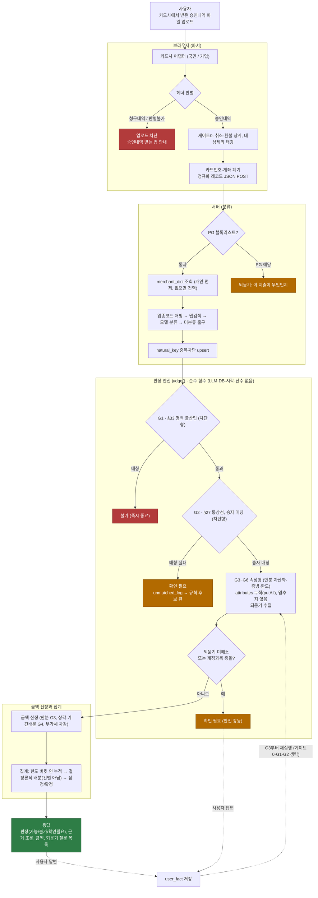
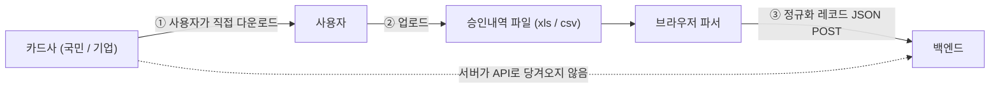
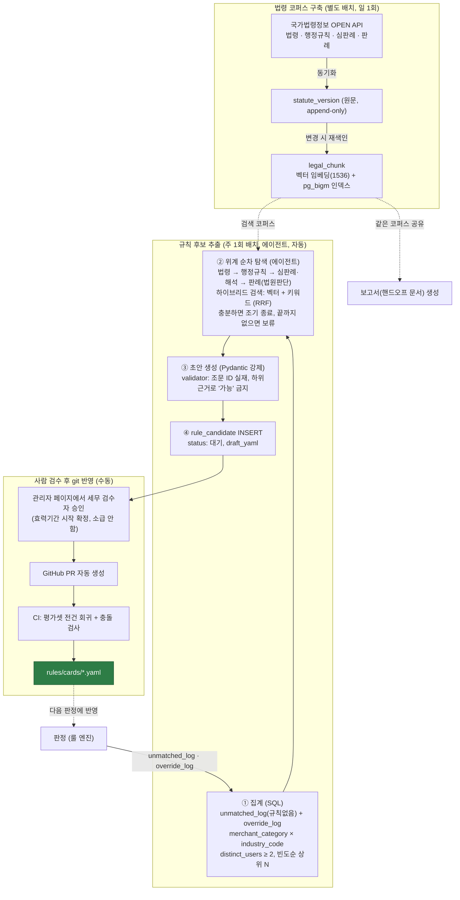

# 아키텍처 · 파이프라인 플로우

카드 승인내역이 **업로드부터 판정 응답까지** 어떤 필터를 거치는지 한눈에 정리한 문서이다.
설계 근거와 대안은 [`CONTEXT.md`](../CONTEXT.md)에 모두 있고, 이 문서는 그 흐름을 요약해 그림으로 옮긴 것이다.

> 다이어그램은 **목표 아키텍처**를 그린 것이다. 현재 구현 범위는 문서 하단 [구현 범위](#구현-범위)를 참고한다.

---

## 1. 요청에서 응답까지

사용자가 승인내역 파일을 올리면 브라우저가 파싱하고 정리한 뒤, 서버가 분류하고 판정해서 건별 결과를 돌려준다.

**핵심 성질**

- **차단형(G1·G2)은 조건에 걸리면 즉시 종료하고, 속성형(G3~G6)은 걸려도 멈추지 않고 정보만 누적한다.** 코드로는 `return`과 `putAll`의 차이다.
- **G6 한도는 건별로 계산하지 않는다.** 건별로는 버킷 태그만 붙이고, 실제 인정액은 모든 거래 판정이 끝난 뒤 집계 단계에서 배분한다. 건별로 계산하면 처리 순서에 따라 답이 달라져 재현성이 깨지기 때문이다.
- **최악의 결과가 틀린 답이 아니라 질문 하나 더가 되도록 설계했다.** 규칙이 없거나 되묻기가 풀리지 않으면 확인 필요로 안전하게 강등한다.

---

## 2. 거래 데이터는 언제 어떻게 들어오는가

**카드사 API로 데이터를 당겨오지 않는다.** 사용자가 직접 카드사에서 승인내역을 내려받아 파일로 올린다.

- 1차 대상 카드사는 **국민·기업 2종**이다.
- **승인내역만 받는다.** 청구내역은 업로드 단계에서 차단한다. 청구내역은 할부가 12줄로 쪼개져 있어서, 350만원짜리 맥북이 29만원 12건으로 보여 자산 판정을 빠져나가기 때문이다(오탐).
- 카드번호·계좌번호·이용고객명은 브라우저에서 폐기하고, 정규화한 레코드만 서버로 보낸다.

---

## 3. 규칙 카드 생성 파이프라인 (RAG · 학습 루프)

**"AI가 규칙을 만들고, 규칙이 판정한다."** 판정 경로에는 LLM이 없다. LLM은 판정하지 못한 항목을 규칙 초안으로 만드는 자리에만 쓰인다.

- **후보는 DB에, 확정된 카드는 git에 둔다.** 에이전트가 초안(`draft_yaml`)까지 자동으로 만들고, 그다음부터는 사람이 맡는다. 세무 검수자가 관리자 페이지에서 승인하면 PR이 자동으로 생성되고, CI 회귀를 통과해야 머지된다. 규칙 승격에는 항상 사람이 개입하며, 승인 시점에 효력기간 시작일을 지정해 **소급 적용하지 않는다.**
- **RAG는 판정 경로에 쓰지 않는다.** 위계 순차 탐색(벡터와 키워드를 RRF로 융합한 하이브리드 검색)은 **규칙 카드 초안 생성**과 **보고서 생성** 두 곳에서만 쓰고, 두 기능은 같은 `legal_chunk` 코퍼스를 공유한다. 판정 화면의 근거는 규칙 카드에 하드코딩된 조문 ID로 DB에서 직접 조회한다. LLM이 조문 문자열을 지어내지 않는다.
- **위계는 코드로 강제한다.** 법령 → 행정규칙 → 심판례·해석 → 판례 순으로 탐색하고, 하위 근거가 상위를 뒤집는 초안(예: 판례만으로 '가능')이나 실재하지 않는 조문 ID는 Pydantic validator가 막는다. 자세한 내용은 `CONTEXT.md`의 §9.5(규칙 후보 추출)와 §10(RAG)에 있다.

---

## 부연 설명

### 구현 범위

이 문서의 다이어그램은 목표 흐름을 그린 것이고, 일부 단계는 아직 구현 전이다.

- **구현됨**: 룰 로더와 검증, Python 파서·정규화·룰 검증(`tools/`), `rules/*.yaml`.
- **설계·미착수**: 판정 엔진 `judge()`(G1~G6, 되묻기, 안전 강등), 한도 집계·확정, 판정 영속성, REST 요청·응답 계층, 금액 산정(computeAmount), 서버측 분류(merchant_dict·웹검색·모델 분류, AI 서버), 브라우저 파서(프론트).

### natural_key (중복 방지 키)

`natural_key = hash(승인일 + 상호원문 + 금액 + 승인번호)`이고 UNIQUE다. 같은 파일을 두 번 올려도 중복으로 계상되지 않게 막는다.

승인번호를 재료에 넣은 이유와 실데이터 137건 검증 결과(추가 전에는 별개 거래 5행이 충돌했으나 추가 후 0건이고, 중복 차단 기능은 그대로다)는 [`docs/schema_mapping.md`의 §4](./schema_mapping.md)에 있다. 승인번호만 단독으로 쓰지 않는 이유(8자리라 재사용될 수 있고 카드사마다 체계가 다르다)도 같은 문서에 정리돼 있다.

### 판정의 결정론

`judge()`는 순수 함수이다. LLM도, DB나 현재 시각, 난수도 참조하지 않는다. 그래서 같은 입력에는 항상 같은 결과가 나온다. 분류 모델이 틀리더라도 규칙 매칭이 실패해 확인 필요로 떨어질 뿐, 틀린 판정이 나가지는 않는다.

### 관련 문서

- [`CONTEXT.md`](../CONTEXT.md): 설계 논의·결정·대안 전체 (단일 원본)
- [`docs/schema_mapping.md`](./schema_mapping.md): 파서 출력과 transaction 스키마 대조, natural_key 검증
- [`docs/limit-settlement.md`](./limit-settlement.md): 연간 한도 집계·배분·상태 전이
