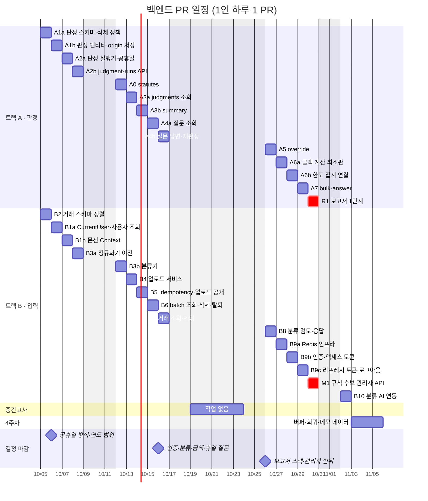
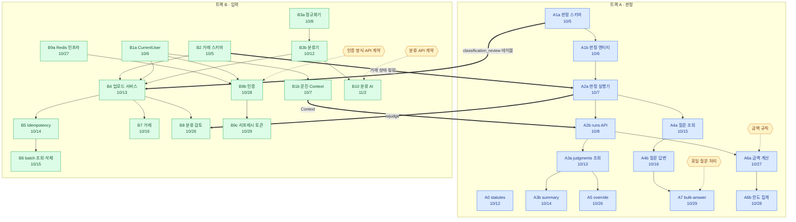
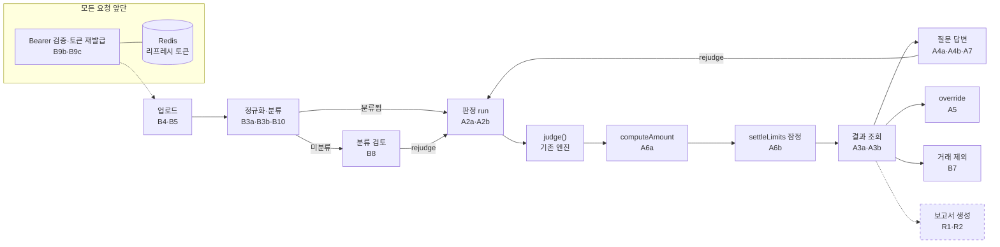
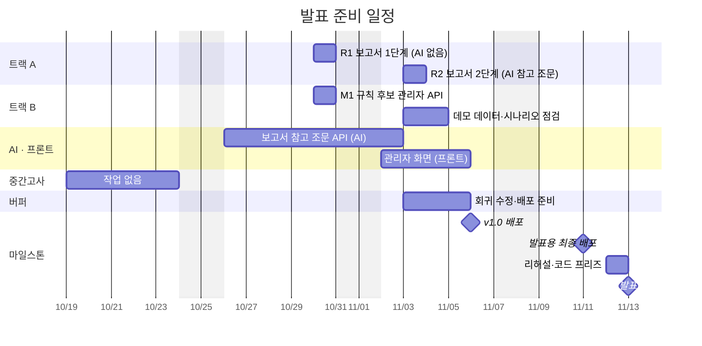

# 백엔드 API 및 서비스 계층 구현 계획 (2026년 10월)

> 목표: 10/30까지 업로드부터 질문 응답과 수정까지 실제 서비스에서 동작하도록 한다.
> 기준은 프론트엔드의 `frontend/src/api/index.ts`를 mock에서 HTTP 호출로 전환할 수 있는 상태다.
> 10/19~10/23은 중간고사 기간이라 작업하지 않는다. 10/30부터는 발표 기능 개발과 버퍼에 사용한다. v1.0 배포는 11/6, 발표는 11/13이다.

## 한눈에 보기

| 항목 | 내용 |
| --- | --- |
| 인원 | 백엔드 담당자는 2명이다. 트랙 A(판정)와 트랙 B(입력)로 역할을 나눈다. |
| 개발 방식 | 에이전트가 코드를 작성하고, 사람은 리뷰와 merge를 담당한다. PR 하나는 시작부터 merge까지 최대 하루가 걸린다고 보고, 1인당 하루에 PR 하나씩 진행한다. 의존 관계가 허용하면 다음 PR을 바로 시작한다. |
| PR 크기 | 추가 줄 수는 1000줄 이하다. 테스트 코드, 마이그레이션 SQL, worklog를 모두 포함한 GitHub `+` 수치를 기준으로 한다. |
| PR 수 | 기본 흐름은 27개(트랙 A 13, 트랙 B 14), 발표 기능은 3개(R1, R2, M1)다. 기본 흐름은 B10을 빼면 10/30에, B10까지 11/2에 끝난다. |
| 시험 기간 | 10/19~10/23은 중간고사라 PR을 진행하지 않는다. 그 주에 있던 PR은 10/26 주로 한 주씩 미뤘다. |
| 기본 흐름 범위 | 기본 흐름과 임시 사용자를 구현하고, 3주차에 인증을 도입한다. 리프레시 토큰 저장소로 Redis를 새로 도입한다. 공휴일 목록, 금액 계산 최소판, 분류 AI 연동, bulk-answer를 포함한다. |
| 발표 기능 | 보고서(핸드오프 문서) 생성 1·2단계와 규칙 후보 관리자 API다. 발표에서 "AI 에이전트"를 설명하는 근거가 되는 기능이다. [발표 준비](#발표-준비)를 참고한다. |
| 발표 이후 | 분류 웹 검색, 금액 계산 완전판, 승인 시 GitHub PR 자동 생성 |
| 미룰 순서 | 기본 흐름이 밀리면 B10 분류 AI → A7 bulk-answer → A6 금액 계산 순서로 미룬다. 단, 인증 작업(B9a~B9c)은 미루지 않는다. |
| 저장소 | Idempotency-Key는 Postgres에, 리프레시 토큰은 Redis에 둔다. 근거는 [저장소 결정](#저장소-결정)에 있다. |

### 일정

빨간 막대(R1, M1)는 발표 기능이다. 일정과 나머지 마일스톤은 [발표 준비](#발표-준비)에 정리한다.

### PR 의존 관계

화살표는 선행 PR이 merge된 뒤에 후속 PR을 시작할 수 있음을 나타낸다.
굵은 화살표는 트랙 간 접점을 나타내고, 육각형은 직접 내려야 하는 의사결정을 뜻한다.
노드의 날짜는 계획상 merge 날짜다.

### 완성 후 요청 흐름

각 PR이 실제 요청 흐름에서 담당하는 단계를 보여준다. 점선 노드는 발표 기능이다.

## 공통 규칙

- 진행 방식
  - 에이전트가 코드를 작성하고, 사람은 리뷰와 merge를 담당한다.
  - PR을 올리기 전에 에이전트 리뷰를 먼저 실행한다. 사람 리뷰는 에이전트의 지적사항과 스키마, 도메인 규칙(세법, api.md 계약)에 집중한다.
  - 직렬 사슬(A1a → A1b → A2a → A2b, B3a → B3b → B4 → B5 → B6)은 하루가 밀리면 뒤 작업도 모두 밀린다. 지연은 4주차 버퍼로 흡수한다.
- 목 교체 절차: `backend/README.md`의 "목 응답" 절차를 따른다.
  1. 컨트롤러에 주입된 `*MockData`를 서비스 코드로 교체한다.
  2. 해당 메서드의 `@MockResponse`를 삭제한다.
  3. 사용하지 않는 mock 메서드를 삭제한다.
  - `ApiResponseContractTest`와 `ApiContractIntegrationTest`는 항상 통과(green)해야 한다.
- 패키지 구조: 기존 관례인 `<feature>.api`, `domain`, `persistence` 구성을 따른다. 서비스는 기능별 패키지에 배치한다. 공용 계층은 두 개 이상의 기능에서 실제로 공유할 때만 새로 만든다.
- 마이그레이션 번호: 두 트랙의 PR에서 번호가 충돌할 수 있다. merge 직전에 develop 브랜치의 최신 번호 +1로 변경(rename)한다. 이미 적용된 마이그레이션은 수정하지 않는다(`db/README.md`).
- 기존 행이 있는 테이블에 제약을 추가할 때는 "컬럼 추가 → 기존 행 채우기(backfill) → 제약 추가" 순서로 작성한다. 운영 DB가 비어 있다는 전제에 의존하지 않는다.
- PR 크기 확인: PR을 올리기 전에 `git diff --shortstat origin/develop...HEAD`를 확인한다. 추가 줄 수가 1000줄을 초과하면 작업을 "스키마 및 엔티티"와 "서비스 및 API"로 나눈다.
- PR별 검증 항목:
  - `.\backend\gradlew.bat -p backend test` 실행
  - `integrationTest` 실행 (Docker 필요)
  - eval 리포트에서 기능 회귀가 없는지 확인
  - `/worklog` 작성
- 시나리오 통합 테스트는 마지막에 한꺼번에 만들지 않고 누적한다. B5와 A2b가 merge되면 "업로드 → run" 시나리오를 만들고, 이후 각 PR에서 담당 단계를 이어 붙인다.
- 사용자 식별: B1a에서 `CurrentUser` 리졸버를 작성한다. 모든 서비스는 이를 통해 userId를 전달받는다. 초기에는 고정 임시 사용자를 반환하고, B9b에서 구현체만 Bearer 토큰 검증 방식으로 교체한다.

## 사전 정리 (10/5 작업 시작 전)

마이그레이션과 응답 형식의 충돌을 방지하려면 현재 열려 있는 아래 브랜치를 먼저 merge한 뒤 작업을 시작한다.

- `chore/release-from-develop`
- `chore/db-deploy-safety`: 마이그레이션 호환 규칙
- `feature/classification-group-transactions`: 분류 그룹 응답 변경

## 트랙 분담

- 트랙 A(판정): 판정 스키마, run, 결과 조회, 질문, override, 금액 계산, bulk-answer, 보고서를 담당한다. 엔진과 영속 서비스를 감싸는 영역이다.
- 트랙 B(입력): 사용자 및 문진, 거래 스키마, 업로드, 정규화와 분류, 거래, 분류 검토, 인증, 관리자 API를 담당한다. 판정에 입력할 데이터를 가공하는 영역이다.
- 두 트랙 사이의 접점은 다음 네 곳이다.
  1. `classification_review` 테이블은 판정 origin FK의 대상이므로 A1a에서 만든다. B4는 이 테이블에 행을 쓰기 때문에 A1a가 B4보다 먼저 merge되어야 한다.
  2. B2의 거래 상태 컬럼(`user_inclusion`, `classification_status`)은 트랙 A의 run 대상 선정과 현재 결과 필터링에 사용한다. 따라서 B2가 A2a보다 먼저 merge되어야 하므로 B2를 트랙 B의 첫 PR로 둔다.
  3. A2b의 run 생성은 `contextId`를 받으므로 B1b(문진 Context)가 먼저 merge되어야 한다.
  4. A2a는 `rejudge(transactionIds, origin, contextVersion)` 진입점을 제공한다. 재판정에 사용할 Context는 호출하는 쪽에서 api.md 규칙에 따라 정해 전달한다. B8 분류 응답과 A4b 질문 응답이 이를 호출한다.
- 삭제 정책은 A1a에서 한 번에 설계한다. batch를 삭제할 때 함께 삭제되어야 하는 테이블(api.md §6)의 FK에 `ON DELETE CASCADE`를 적용한다. B6에서는 전체 그래프를 삭제하는 통합 테스트로 이를 확인한다.
- 작업 순서는 프론트엔드 화면 순서(업로드 → 분류 → run → 결과 → 질문)에 맞춘다. 프론트엔드가 앞 화면부터 차례로 HTTP 호출로 전환할 수 있도록 한다.

## 주차별 PR

### 1주차 (10/5~10/8, 10/9 한글날): 판정 실행 기반

| PR | 트랙 | 날짜 | 내용 |
| --- | --- | --- | --- |
| A1a | A | 10/5 | 판정 쪽 스키마와 삭제 정책을 만든다. `judgment_run`, `judgment_run_item`, `judgment_override`, `classification_review` 테이블을 추가한다. `judgment`에는 origin 컬럼 4개를 추가하고 `state` 컬럼을 제거한다. `CHECK num_nonnulls(...)=1`은 기존 행을 채운 뒤 적용한다(운영 DB의 `judgment` 행 수를 먼저 확인한다). `user_fact.batch_id`를 추가하고 `question_queue.status`를 PENDING, ANSWERED, CANCELED로 변경한다. `judgment.transaction_id`처럼 cascade가 빠진 기존 FK도 api.md §6에 맞게 수정한다. |
| A1b | A | 10/6 | 판정 엔티티와 저장 로직에 A1a의 변경 사항을 반영한다. `JudgmentService.save`가 origin을 받도록 변경하고 `JudgmentSchemaIntegrationTest`를 수정한다. |
| A2a | A | 10/7 | 판정 실행기를 구현한다. `RuleCardLoader`를 통해 서버가 기동할 때 `RuleSet`을 한 번 로드해 빈으로 등록한다. 공휴일 목록을 [미리 정해야 할 것](#미리-정해야-할-것)에서 정한 방식으로 읽어 `judge(..., publicHolidays)`에 전달한다. 거래 1건을 판정하고 저장하는 `JudgmentExecutor`와 `rejudge(transactionIds, origin, contextVersion)`을 작성한다. `judge()` 자체는 순수 함수로 유지한다. |
| A2b | A | 10/8 | `POST /judgment-runs`(202 QUEUED), `GET /judgment-runs/{id}`, `/failures`를 구현한다. 트랜잭션이 커밋된 뒤 `@Async`로 비동기 실행한다. 건별 실패 내역은 `judgment_run_item`에 기록한다. 대상은 `effectiveStatus=JUDGEABLE`이면서 `classificationStatus=CLASSIFIED`인 거래다. |
| B2 | B | 10/5 | 거래 스키마를 api.md에 맞춘다. `transaction.user_id`를 추가하고 기존 행을 채운 뒤 FK를 적용한다. 전역 `UNIQUE(natural_key)`는 `UNIQUE(user_id, natural_key)`로 변경한다. `status` 하나를 `source_status`, `user_inclusion`, `classification_status`로 나눈다. `installment_months`는 기본값을 0으로, CHECK를 `>= 0`으로 변경한다. 업로드로 받는 `approval_no`, `biz_no`, `branch`, `branch_raw`, `memo`, `is_aggregated`, `needs_review`, `review_reason`, `source_card` 컬럼을 추가한다(`docs/schema_mapping.md`). `UNIQUE(user_id, file_hash)`는 `upload_batch`에 이미 있다. `TransactionRecordEntity`와 `UploadBatchEntity`에 전체 컬럼을 매핑한다. |
| B1a | B | 10/6 | `CurrentUser` 리졸버와 임시 사용자 시드를 구현한다. `GET /users/me`를 구현하고 `app_user` 엔티티를 V1 테이블에 매핑한다. 첫 mock 교체 PR에서 패턴을 정한다. 탈퇴(`DELETE /users/me`)는 삭제 정책이 갖춰진 뒤 B6에서 구현한다. |
| B1b | B | 10/7 | `POST/GET /users/me/contexts`, `contexts/current`를 구현한다. `user_context` 엔티티를 V1 테이블에 매핑한다. |
| B3a | B | 10/8 | `engine/.../T1Normalizer` 로직을 backend로 이전하고 `rules/normalize.yaml`을 읽는다. Python `load()`와 같이 `rules/brands.yaml`(브랜드 사전)과 `rules/pg_blocklist.yaml`(PG 힌트)도 단계에 넣는다. 순수 컴포넌트로 유지하며 fixture 기반 단위 테스트도 함께 옮긴다. `engine/`은 지운다(#79). |

### 2주차 (10/12~10/16): 업로드, 조회, 질문

| PR | 트랙 | 날짜 | 내용 |
| --- | --- | --- | --- |
| A0 | A | 10/12 | `GET /statutes/{id}`를 실제 서비스로 구현한다. |
| A3a | A | 10/13 | `GET /judgments`와 `GET /judgments/{id}`를 구현한다. 필터는 batchId, year, transactionId, runId, verdict, latestOnly다. 현재 결과에는 api.md §5 규칙을 적용한다. 활성 상태인 override가 있으면 우선 적용하고, 없으면 override가 아닌 최신 revision을 채택한다. EXCLUDED 상태의 거래는 결과에서 제외한다. `latestOnly=false`는 revision 이력을 조회한다. |
| A3b | A | 10/14 | `GET /judgments/summary`를 구현한다. verdict별, 계정별 집계를 반환한다. batchId, year, runId 중 정확히 하나만 받으며, 그렇지 않으면 `INVALID_SUMMARY_SCOPE`를 반환한다. |
| A4a | A | 10/15 | `GET /questions`를 구현한다. grouped 응답과 미해소 집계를 포함한다. |
| A4b | A | 10/16 | `POST /question-responses`를 구현한다. `UserFactPersistenceService.answerQuestion`을 재사용하고 UserFact는 batch scope로 관리한다. 같은 scope의 거래를 질문이 발생한 원래 Judgment의 Context로 `rejudge`하고, origin은 `trigger_user_fact_id`로 설정한다. 답변 정정과 형제 질문 처리는 `worklog/be/2026-09-26-merge-mock-into-spring.md`에 정리된 결정을 따른다. |
| B3b | B | 10/12 | 가맹점 분류기를 구현한다. `MerchantDictionaryRepository`(개인 → 전역) → `keyword_rules.yaml` → 실패 시 `미분류` 순서로 처리한다. 분류기는 인터페이스로 두어 B10에서 AI 단계를 끼울 수 있도록 한다. |
| B4 | B | 10/13 | 업로드 서비스를 구현한다. 파일은 프론트에서 파싱하고, 서버는 정규화된 레코드(JSON)만 받는다. natural_key가 중복된 건은 건너뛰고 건수를 집계한다. file_hash가 중복되면 409를 반환한다. 미분류 거래가 발생하면 `ClassificationReview`를 생성한다. Idempotency 없이 공개하면 계약을 어기므로 엔드포인트의 mock은 아직 교체하지 않는다. |
| B5 | B | 10/14 | `Idempotency-Key`를 구현하고 `POST /upload-batches`를 공개한다. `idempotency_key` 테이블에 `(user_id, key)` UNIQUE, payload 해시, 최초 응답 스냅샷, 상태, `expires_at`을 둔다. 업로드 저장과 같은 트랜잭션으로 처리한다. 400, 409, 410과 만료된 키의 새 요청 처리, 동시 요청을 테스트한다. 정상 응답 코드는 201이다. |
| B6 | B | 10/15 | `GET /upload-batches`(목록 및 상세), `DELETE /upload-batches/{id}`, `DELETE /users/me`를 구현한다. 판정, 질문, override까지 채운 batch를 삭제하는 통합 테스트로 연쇄 삭제를 확인한다. batch를 삭제하면 idempotency 키는 지우지 않고 상태를 `DELETED`로 바꿔 남긴다. |
| B7 | B | 10/16 | `GET /transactions`(목록 및 상세)와 `POST /transactions/{id}/exclude`, `include`를 구현한다. |

### 3주차 (10/26~10/30, 중간고사 다음 주): 수정, 확장, 인증

| PR | 트랙 | 날짜 | 내용 |
| --- | --- | --- | --- |
| A5 | A | 10/26 | `POST /judgments/{id}/override`와 `DELETE /judgment-overrides/{id}`를 구현한다. 생성되는 override revision의 origin은 `judgment_override_id`로 지정한다. |
| A6a | A | 10/27 | 금액 계산 최소판을 구현하고 G3 안분 비율을 적용한다. 자산 처리 규칙은 착수 전에 `CONTEXT.md` §14를 기준으로 확정한다. 자산 경계는 100만 원 "초과"이고, 무신고 시 건축물 외 유형자산의 기본 상각방법은 정률법이다. 정액 5년은 맥북 예시일 뿐 일반 규칙이 아니다. 상각방법이나 내용연수를 알 수 없으면 금액을 확정하지 않고 확인 필요로 둔다. |
| A6b | A | 10/28 | run 실행 순서를 `judge → computeAmount → settleLimits(잠정)`으로 구성하고 `LimitBucketPersistenceService.replaceProvisional`을 연결한다. |
| A7 | A | 10/29 | `POST /questions/bulk-answer`를 구현한다. 단건 답변 로직을 반복해서 호출하되, 같은 거래는 한 번만 재판정한다. 소명 대기 거래(Override를 뺀 최신 자동 판정이 불가인데 대기 질문이 남은 거래)의 질문은 대상과 `answer.value` 허용 검사에서 빼고 `excludedCount`로 센다(api.md 3.11, #103). |
| R1 | A | 10/30 | 보고서 1단계. [발표 준비](#발표-준비)를 참고한다. |
| B8 | B | 10/26 | `GET /classification-reviews`와 `POST /classification-responses`를 구현한다. 사용자 응답은 개인 scope의 `merchant_dict`에 저장한다. 해당 batch에 완료된 run이 없으면 분류만 확정하고 `judgedCount=0`으로 응답한다. 완료된 run이 있으면 최근 run의 Context로 `rejudge`한다(api.md "판정 처리" 절). |
| B9a | B | 10/27 | Redis 인프라를 추가한다. 로컬 `compose.yaml`, `deploy/compose.yaml`(`maxmemory` 128MB, AOF 켜기), `deploy/deploy.sh` 헬스체크, `spring-boot-starter-data-redis`, Testcontainers Redis 설정을 포함한다. |
| B9b | B | 10/28 | 인증을 도입한다. 확정한 인증 API 계약에 따라 로그인과 액세스 토큰(JWT) 발급을 구현한다. `CurrentUser` 리졸버 구현체는 Bearer 토큰 검증 방식으로 교체한다. |
| B9c | B | 10/29 | 리프레시 토큰 재발급과 로그아웃을 구현한다. 저장 규칙은 [저장소 결정](#저장소-결정)을 따른다. 탈퇴하면 해당 사용자의 토큰을 모두 삭제한다. |
| M1 | B | 10/30 | 규칙 후보 관리자 API. [발표 준비](#발표-준비)를 참고한다. B10보다 먼저 진행한다. 버퍼가 줄어서 발표에 필요한 M1을 먼저 확보한다. |

### 4주차 (11/2~11/5): 발표 기능과 버퍼

| PR | 트랙 | 날짜 | 내용 |
| --- | --- | --- | --- |
| B10 | B | 11/2 | 분류 AI를 연동한다. B3b 분류기에서 사전과 키워드로 분류하지 못한 가맹점만 모아 분류 API를 한 번에 호출한다. 분류 API의 위치와 담당은 [미리 정해야 할 것](#미리-정해야-할-것)에서 정한다. 호출은 DB 트랜잭션을 열기 전에 수행한다. 타임아웃(3초 안팎)이 발생하거나 호출이 실패하면 해당 거래를 `미분류`로 둔다. 모델 결과는 전역 `merchant_dict`에 저장하지 않는다(`CONTEXT.md` 흔한 실수 #18). 분류 API는 처음에 모두 `null`을 반환하는 stub으로 시작하고, 모델이 준비되면 API 쪽만 교체한다. |
| R2 | A | AI API 준비 후 | 보고서 2단계. AI 쪽 참고 조문 API가 11/2까지 준비되면 11/3에 진행한다. 늦어지면 11/4~11/5 버퍼로 옮긴다. |
| 버퍼 | A·B | 11/3~11/5 | 밀린 PR, 회귀 수정, 누적 시나리오 테스트 보강, 데모 데이터(`CONTEXT.md` §15 히어로 시나리오) 준비 |

## 미리 정해야 할 것

결정 마감이 10/16에 몰려 있다. 결정이 늦어지면 해당 PR만 4주차 버퍼로 밀린다.

| 마감 | 결정 사항 | 대상 PR |
| --- | --- | --- |
| 10/6 | 공휴일 목록을 가져오는 방식과 연도 범위. 회의에서는 공휴일을 공공 API로 판단하기로 했다(`worklog/be/2026-09-30-holiday-flag.md`). 판정할 때마다 API를 호출할지, API 결과를 DB나 YAML에 저장해 두고 읽을지, 정적 YAML만 둘지 정한다. 판정할 때마다 호출하면 임시공휴일이 추가된 뒤 재판정 결과가 달라질 수 있고, API 장애가 판정 실패로 이어진다. | A2a |
| 10/16 | 인증 방식(카카오 OAuth, 자체 JWT 등)과 인증 API 계약. 로그인·재발급·로그아웃 엔드포인트, 토큰 전달 위치(헤더 또는 쿠키), 액세스·리프레시 토큰 만료 기간, 로그아웃 범위를 api.md에 먼저 작성한다. 리프레시 토큰 저장소는 Redis로 확정했다. | B9b, B9c |
| 10/16 | 분류 단계 배치, 담당, 분류 API 계약(분류 실험 담당·AI 담당과 협의). 어느 분류 단계부터 AI 서버로 넘길지 먼저 정한다. `CONTEXT.md` §12는 분류를 AI 서버에 두지만, 단계별로 나눈 기록은 없고 서비스 구현도 아직 없다. 사전과 `keyword_rules.yaml`은 백엔드(B3b)에서 처리하고, 모델과 웹 검색만 AI 서버에 두는 것을 추천한다. 해외 SaaS 사전(PR #73)과 상권정보 매칭(PR #61)을 어느 쪽에 둘지, 분류 API를 누가 구현할지도 함께 정한다. AI 서버에 두는 경우 배치 요청 `[{ merchantNorm, merchantRaw, bizNo? }]`, 응답 `[{ category 또는 null, confidence }]` 형태를 제안한다. cutoff 미만이면 `null`이다. stub은 10/30까지 필요하다. | B10 |
| 10/16 | 금액 계산 규칙. 안분과 부가세 중 무엇을 먼저 적용할지(`CONTEXT.md` 미결정 #6), 자산 판단과 상각방법 기본값을 정한다. | A6a |
| 10/16 | 휴일 소명 질문의 bulk-answer 처리. **결정(10/7, #103)**: fact_type은 그대로 두고, 휴일 카드(R-311~314)와 생활용품(R-207)을 포함한 소명 대기 거래의 질문을 일괄 응답 대상에서 뺀다. 뺀 수는 `skippedCount`와 별도인 `excludedCount`로 센다(api.md 3.11). 별도 fact_type 안은 그 fact_type으로 일괄 응답하면 같은 문제가 남고 R-207을 놓쳐 쓰지 않았다. | A7 |
| 10/26 | 보고서 스펙(AI 담당자와 협의). 1단계에 포함할 항목과 형식, 2단계 AI 참고 조문의 범위와 표시 방식, 핸드오프 임계값(`CONTEXT.md` 미결정 #8)을 정하고 api.md에 계약을 작성한다. | R1, R2 |
| 10/26 | 관리자 페이지 범위와 담당. 화면 담당(프론트), 관리자 판별 방식, 승인 후 처리 범위를 정한다. 발표에는 후보 큐 조회와 승인·반려까지만 포함하고, GitHub PR 자동 생성은 제외하는 것을 추천한다. | M1 |

## 저장소 결정

| 데이터 | 저장소 | 이유 |
| --- | --- | --- |
| Idempotency-Key와 최초 응답 | Postgres (`idempotency_key` 테이블) | 업로드의 부작용(batch·거래 저장)은 같은 Postgres 안에서 발생한다. 키 기록을 같은 트랜잭션으로 묶으면 "키는 남았는데 batch는 없다"와 같은 불일치가 생기지 않는다. batch를 삭제할 때 키를 `DELETED`로 변경하는 작업도 같은 트랜잭션에서 처리한다. |
| 리프레시 토큰 | Redis | 업무 데이터와 트랜잭션으로 묶을 필요가 없다. TTL로 만료된 토큰을 자동 정리하므로 별도 삭제 작업이 필요 없다. 데이터가 유실되어도 재로그인으로 해결할 수 있어 Redis를 처음 도입할 때의 위험이 작다. |

리프레시 토큰 저장 규칙:

- 리프레시 토큰은 userId와 로그인 세션 식별자(familyId)를 담은 JWT로 발급한다. Redis에서 키가 삭제된 뒤에도 누구의 토큰인지 알 수 있어야 하기 때문이다.
- 키 구조
  - `refresh:{familyId}` → `{ userId, tokenHash }`. TTL은 리프레시 토큰 만료 기간과 같다.
  - `user:{userId}:families` → 해당 사용자의 familyId Set. 탈퇴(`DELETE /users/me`)나 전체 로그아웃 시 한 번에 삭제하는 데 사용한다. 로그인할 때마다 Set의 TTL을 리프레시 토큰 만료 기간으로 갱신해 오래된 Set이 남지 않도록 한다.
- 토큰 원문 대신 해시를 저장한다.
- 재발급(rotation)은 Lua 스크립트 하나로 원자적으로 처리한다. 저장된 tokenHash와 전달된 토큰이 같으면 새 토큰의 해시로 변경한다. 다르면 이미 사용된 토큰을 재사용한 것으로 판단해 해당 family를 삭제한다(해당 기기만 로그아웃).
- AOF를 켜서 재배포 시 모든 사용자가 로그아웃되지 않도록 한다. EC2 메모리가 4GB이므로 `maxmemory`를 128MB로 제한한다.

## 발표 준비

발표(11/13)에서 "AI 에이전트가 아니라 룰 엔진 아닌가요?"라는 질문에 대한 답변(`CONTEXT.md` §15)은 두 기능을 근거로 한다.
"에이전트가 규칙을 만들고(규칙 후보 추출), 세무사에게 넘길 문서를 만든다(보고서)."
규칙 후보 추출 파이프라인은 AI 쪽에 이미 있지만, 발표에서 보여줄 관리자 화면은 없다.
보고서는 계약과 구현이 모두 없다. 두 트랙 모두 10/30에 기본 흐름 PR을 마치고 두 기능을 추가한다.

| PR | 트랙 | 날짜 | 내용 |
| --- | --- | --- | --- |
| R1 | A | 10/30 | 보고서 1단계를 구현한다. AI 없이 기존 데이터만 템플릿으로 모은다. 대상은 다음과 같다. 확인 필요와 범위 밖 거래 목록, 계정별 합계와 한도 초과 현황, 사용자 답변과 미해소 질문, 판정에 사용한 근거 조문(룰카드 citations), 판정하지 못한 이유(`unmatchedReason`, `outOfScope`). 계약은 2단계의 비동기 생성까지 고려해 정한다. |
| M1 | B | 10/30 | 규칙 후보 관리자 API를 구현한다. `rule_candidate` 목록 조회(대기·보류 상태, 초안 YAML, 근거)와 승인·반려를 제공한다. 관리자만 접근할 수 있도록 한다. 승인 후 GitHub PR 자동 생성은 발표 범위에서 제외한다. |
| R2 | A | 11/3 | 보고서 2단계를 연동한다. 규칙이 없던 거래에만 AI가 찾은 참고 조문을 붙인다. AI 호출은 느리므로 run처럼 "202 접수 → 폴링" 구조로 구현한다. AI가 찾은 근거는 룰카드 근거와 구분해 표시한다. "근거 오적용"은 기계로 걸러낼 수 없으므로 세무사가 출처를 보고 판단할 수 있어야 한다. |

- AI 쪽: 보고서 참고 조문 API는 규칙 후보 추출의 질의 작성(`query.py`), 위계 검색(`search.py`), 근거 선택(`select.py`)을 재사용한다. 중간고사가 끝난 10/26부터 작업해 11/2까지 준비되면 R2를 11/3에 진행하고, 늦어지면 11/4~11/5 버퍼로 옮긴다.
- 우선순위: 기본 흐름이 밀려 버퍼를 모두 사용하면 M1 → R1 → R2 순서로 지킨다. M1이 없으면 발표 답변의 전제인 "규칙 후보 큐를 보여줄 것"이 무너진다.
- 발표 이후로 미루는 것
  - 분류 웹 검색: B10의 분류 API 뒤에 AI 쪽에서 추가한다.
  - 금액 계산 완전판: 여러 해에 걸친 감가상각과 선급비용(`asset_ledger`, `depreciation_schedule`, `prepaid_schedule`)이다.
  - 승인 시 GitHub PR 자동 생성

## 문서 정리

- mock 교체를 완료하는 PR에서 현재 코드와 맞지 않는 설명도 함께 수정한다.
  - `docs/architecture.md` "구현 범위"
  - `backend/README.md` "단위 테스트 NO-SOURCE"
  - `docs/deployment.md` "501"
- 설계 맥락을 설명해야 하는 비자명한 결정은 해당 PR에서 `docs/`에 기록한다.
  - 저장소 결정(위 절의 내용을 `docs/architecture.md`로 옮긴다)
  - run 비동기 방식
  - 삭제 정책
  - 금액 계산 규칙

## 완료 기준

1. 모든 컨트롤러에서 `@MockResponse`를 제거하고 `MockFixtures`와 `*MockData`를 삭제한다.
2. `gradlew -p backend check` 명령어가 통과(green)해야 한다. 여기에는 unit 테스트, eval 테스트, integrationTest가 모두 포함된다.
3. 누적해 온 시나리오 통합 테스트가 api.md §8.1~8.6의 흐름을 모두 포함해야 한다. 검증 흐름은 업로드 → 분류 응답 → run → 결과 조회 → 질문 답변 재판정 → override → 거래 제외 → batch 재판정 순서다.
4. 로컬 환경에서 `docker compose up -d postgres redis`와 `bootRun --args="--spring.profiles.active=local"`을 실행한다. 프론트엔드의 `api/index.ts` 설정을 HTTP 호출로 전환한 뒤 업로드부터 결과 화면까지 정상적으로 동작하는지 직접 확인한다.
